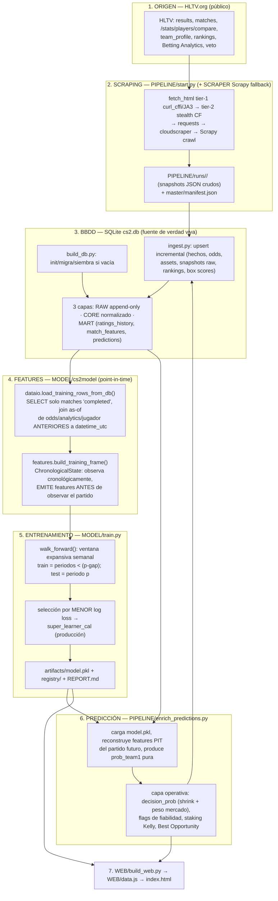

# AUDITORÍA — CS2 Match Predictor

> **Alcance:** auditoría de solo lectura del repositorio `CS2-PREDICTOR-WEB`, rama `pre-dev`
> (commit `e35e6fb`), realizada el **2026-07-27**. No se ha modificado, borrado ni creado
> código: este documento es el único fichero nuevo.
>
> **Nota sobre rutas:** el enunciado apuntaba a `C:/Users/aleja/.../CS2-Predictor/CS2/`.
> El repositorio auditado es el clon local en `CS2-PREDICTOR-WEB/`, cuyo dominio CS2 vive en
> [`CS2/`](../). Todas las citas `fichero:línea` son relativas a la raíz del repo.
>
> **Método:** lectura directa de código y documentación + un sub-agente de exploración para
> el subárbol `SCRAPER/`. Todas las cifras se citan con su fuente; donde hay discrepancias
> entre documentos se señalan explícitamente.

---

## 0. Resumen de una página (TL;DR de auditor)

- Proyecto **maduro y sorprendentemente bien documentado** para ser académico: 107 funciones
  de test en 19 ficheros, CI en GitHub Actions, config centralizada validada, manifiestos de
  reproducibilidad con SHA-256, y una disciplina anti-fuga temporal explícita y verificada por test.
- La arquitectura tiene una **buena idea rectora**: la BBDD guarda *hechos con timestamp*; las
  features son *vistas point-in-time reconstruibles*. Esto convierte el "cero fuga" en una
  propiedad de diseño, no de vigilancia manual.
- El **65 % de accuracy** es real pero **matizable**: el walk-forward da **0.6443** de accuracy
  del favorito, prácticamente **igual que el baseline Elo/Glicko (~0.60–0.61)**. El valor del
  modelo está en log loss / calibración / AUC, **no** en la accuracy. Ver §6.
- Riesgos principales detectados: (a) **selección de modelo sobre el mismo conjunto OOS que se
  reporta** (sesgo optimista leve); (b) el **test de fuga solo cubre el núcleo rolling**, no las
  familias enriquecidas (analytics/jugador/odds); (c) **cifras inconsistentes entre documentos**
  (drift de doc). El hallazgo original de dependencias quedó resuelto el 2026-08-11 con CPython
  3.13 y locks hashados separados por componente.
- Nada de esto es bloqueante para un TFM/proyecto académico; son mejoras de rigor. Detalle y
  preguntas al final.

---

## 1. Árbol de carpetas — qué hace cada parte

```
CS2-PREDICTOR-WEB/
├── start.ps1                 # wrapper 2 líneas → delega en CS2/start.ps1  (start.ps1:1)
├── pyproject.toml            # agregador multideporte (pytest/ruff/mypy) apuntando a CS2/
├── README.md                 # índice multideporte
├── .github/workflows/ci.yml  # CI: ruff + mypy + pytest + smoke en push/PR a main/dev/pre-dev
├── .gitignore                # ignora .db, artefactos, runs, secretos (cf_session.json), venvs
│
├── WEB/                      # Dashboard estático COMPARTIDO entre deportes (sin servidor)
│   ├── build_web.py          #   genera WEB/data.js desde la BBDD/artefacto del deporte
│   ├── index.html            #   dashboard cyberpunk: Partidos · Best Opportunity · Modelo · BBDD
│   ├── manifest.webmanifest  #   PWA manifest
│   └── media/logo.png
│
└── CS2/                      # === DOMINIO COMPLETO DE COUNTER-STRIKE 2 ===
    ├── start.ps1             # ENTRYPOINT REAL: orquesta toda la pipeline (478 líneas)
    ├── requirements.txt      # deps del lado modelo + scraper + tooling
    ├── pyproject.toml        # pytest/ruff/mypy del dominio CS2
    ├── PROJECT.md            # especificación de diseño (915 líneas) — fuente de verdad teórica
    ├── README.md            # comandos y estado operativo
    │
    ├── BBDD/                 # Capa de datos (SQLite = fuente de verdad viva)
    │   ├── cs2_prediction_schema.sql  # esquema (3 capas: raw / core / mart)
    │   ├── build_db.py                # crea/migra/siembra cs2.db SOLO si está vacía
    │   ├── ingest.py                  # upsert incremental de cada run del pipeline
    │   ├── export_master_json.py      # export de compatibilidad → PIPELINE/master/matches.json
    │   └── deduplicate_matches.py     # auditoría/fusión de duplicados semilla+HLTV
    │   # (cs2.db, backups/ → gitignored, no versionados)
    │
    ├── SCRAPER/hltv-scraper-api/  # Cliente HLTV (Flask API + proyecto Scrapy) — ver §8
    │   ├── app.py, config.py, Dockerfile, Makefile, requirements.txt, pytest.ini
    │   ├── routes/                # 5 blueprints Flask (teams/players/matches/news/results)
    │   ├── hltv_scraper/          # facade HLTVScraper + SpiderManager + 15 spiders + ~35 parsers
    │   ├── scripts/               # collect_hltv_data.py, collect_player_compare_stats.py (1211 l.)
    │   ├── swagger_specs/         # 12 specs OpenAPI
    │   └── tests/                 # test_routes.py (mock) + test_integration_real.py (live)
    │
    ├── PIPELINE/             # Pipeline diario online
    │   ├── start.py          # (4300 líneas) ORQUESTADOR de scraping: Scrapling tier1/2 +
    │   │                      #   requests/cloudscraper + fallback Scrapy; caché, backoff,
    │   │                      #   circuit breaker, cuarentena de URLs, TTL por entidad
    │   ├── enrich_predictions.py  # (2922 l.) puntúa el run con el modelo + odds + flags + roster
    │   ├── match_context.py  # parseo de la caja "Maps" de HLTV (LAN/online, fase, incentivo)
    │   └── opportunity.py    # cálculo del score "Best Opportunity"
    │   # (runs/, master/, logs/ → gitignored)
    │
    ├── MODEL/               # === NÚCLEO DE ML ===
    │   ├── config.yaml       # config operativa (semilla, umbrales, hiperparámetros, drift)
    │   ├── train.py          # (2324 l.) entrenamiento + walk-forward + selección + artefacto
    │   ├── run_professional_training.py  # sweep CatBoost/half-life/gap
    │   ├── smoke_pipeline.py # smoke E2E determinista (usado por CI)
    │   ├── monitor_drift.py  # drift causal sobre predicciones cerradas
    │   ├── backtest_all_available.py, analyze_failures.py, analyze_walkforward_errors.py,
    │   │   analyze_context_calibration.py, analyze_player_snapshot_ablation.py  # análisis
    │   ├── cs2model/         # paquete del modelo (ver mapa de módulos en §5.4)
    │   │   ├── dataio.py          # (1081 l.) carga desde SQLite point-in-time
    │   │   ├── features.py        # (1611 l.) TODO el feature engineering point-in-time
    │   │   ├── glicko2.py, trueskill.py, kalman_rating.py, bayesian_bt.py  # sistemas de rating
    │   │   ├── compositional_bo3.py   # arquitectura Bo3 por mapa
    │   │   ├── calibration.py, metrics.py, diagnostics.py, drift.py, economic.py,
    │   │   │   optuna_tuning.py, reproducibility.py, rich_targets.py, artifacts.py, config.py
    │   │   └── __init__.py
    │   └── results/          # informes .md versionados (REPORT, CONTEXT_CALIBRATION, ...)
    │       # (*.json, *.csv, registry/, *.pkl → gitignored)
    │
    ├── TESTS/               # 19 ficheros, 107 tests (leakage, odds PIT, métodos, roadmap, ...)
    └── DOCS/                # CHANGELOG.md, extra_features.md, runbooks/
```

**Puntos de entrada, en orden de importancia:** `CS2/start.ps1` (todo) → `PIPELINE/start.py`
(scrape) → `MODEL/train.py` (modelo) → `PIPELINE/enrich_predictions.py` (predicción) →
`BBDD/ingest.py` + `export_master_json.py` (persistencia) → `WEB/build_web.py` (dashboard).

---

## 2. Flujo de datos completo (crudo → BBDD → features → entrenamiento → predicción)



**Idea clave (bien ejecutada):** el **mismo motor de features** (`ChronologicalState` en
`features.py`) se usa en backtest y en producción, así que lo que se entrena es lo que se
predice. La carga de entrenamiento (`dataio.py:916`) solo selecciona partidos `completed`
([dataio.py:948-951](../MODEL/cs2model/dataio.py#L948-L951)) y adjunta odds/analytics/stats
de jugador mediante *joins as-of* que descartan cualquier captura posterior a `datetime_utc`
(filtro point-in-time de analytics en
[dataio.py:1005-1009](../MODEL/cs2model/dataio.py#L1005-L1009)).

**Modo legacy:** `train.py` conserva un camino `--raw <results_all.json>`
([dataio.py:1056-1081](../MODEL/cs2model/dataio.py#L1056-L1081)) para debug sin SQLite; la
ruta por defecto `DEFAULT_RAW` ([train.py:106-109](../MODEL/train.py#L106-L109)) apunta a un
JSON histórico que está gitignored (no versionado). Ver §7 (código legacy).

---

## 3. `start.ps1` paso a paso

`CS2/start.ps1` (478 líneas) es el entrypoint real; la raíz tiene un wrapper de 2 líneas
([start.ps1:1](../start.ps1#L1)) que hace `& CS2\start.ps1 @args`.

### 3.1. Parámetros / flags ([start.ps1:39-59](../start.ps1#L39-L59))

| Flag | Tipo | Efecto |
|---|---|---|
| `-SkipScrape` | switch | No scrapea; reutiliza el último run existente (debug/offline). |
| `-AllowOfflineFallback` | switch | Si el scrape falla, continúa con el último run en vez de abortar. |
| `-Retrain` | switch | Fuerza reentrenamiento (si no, solo entrena si falta el artefacto). También pasa `--verbose` al trainer. |
| `-NoDb` | switch | Salta init e ingest de la BBDD (quita 4 etapas del total). |
| `-MaxMatches N` | int | Limita nº de partidos a scrapear; **no publica master** (añade `--no-promote`). Solo prueba. |
| `-PlayerDelay S` | double (1.5) | Retardo entre peticiones de stats de jugador. |
| `-SkipPlayerStats` / `-SkipTeamProfiles` | switch | Omiten fases de scraping concretas. |
| `-SkipMatchAssets` / `-MatchAssetsLimit N` (20) / `-MatchAssetsDelay S` | | Control del backfill de veto/mapstats. |
| `-SkipAnalytics` / `-SkipRankings` / `-SkipWarmup` | switch | Omiten Betting Analytics / rankings / warm-up de sesión. |
| `-SkipSameDayRecovery` / `-RecoveryWindowDays N` (2) / `-RecoveryDelay S` | | Recuperación de huecos recientes (odds/detalle/analytics). |
| `-RecreateScraperVenv` | switch | Recrea el venv del scraper. |
| `-Quiet` | switch | Reduce logs; sin él, el scraper y el trainer van en `--verbose`. |

### 3.2. Fase 0 — preparación (siempre, antes de contar etapas)

1. Arranca un **transcript** completo en `PIPELINE/logs/start_<timestamp>.log`
   ([start.ps1:70-78](../start.ps1#L70-L78)) + `trap` global que loguea y hace exit 1
   ([start.ps1:80-94](../start.ps1#L80-L94)).
2. `Ensure-ModelPython` exige **CPython 3.13 exacto** y deriva `CS2/.venv`
   exclusivamente de `requirements.lock.txt`: hashes, wheels, pins exactos, `pip check` e
   imports binarios reales. Construye `.venv.build`, valida antes del swap y conserva rollback.
3. Si va a scrapear: `Configure-ScrapeGuards` ([start.ps1:234-263](../start.ps1#L234-L263))
   fija ~30 variables `HLTV_*`/`BBDD_*` (rate limits, backoff, circuit breaker, cuarentena,
   TTLs, flags de Scrapling stealth). `Ensure-CaBundle` genera un CA bundle desde el trust
   store de Windows si detecta inspección TLS corporativa
   ([start.ps1:166-220](../start.ps1#L166-L220)). `Ensure-ScraperPython`
   crea/repara el venv aislado del scraper también con **CPython 3.13 exacto** y solo desde
   su propio lock hashado y wheels. Valida los imports reales antes y después del swap;
   los binarios de navegador de Scrapling se provisionan fuera de pip.

`$total` de etapas se calcula dinámicamente ([start.ps1:376-379](../start.ps1#L376-L379)):
base 4, +4 si hay BBDD (`-not -NoDb`), +1 si toca entrenar.

### 3.3. Etapas numeradas (helper `Invoke-Native`, aborta si exit≠0)

| # | Etapa | Comando | Condición | Cita |
|---|---|---|---|---|
| 1 | Init/siembra BBDD | `python BBDD/build_db.py` | `-not -NoDb` | [382-386](../start.ps1#L382-L386) |
| 2 | **Scrape** HLTV + pendientes | `<venv> PIPELINE/start.py --player-delay ... [flags]` | `-not -SkipScrape` | [388-419](../start.ps1#L388-L419) |
| — | Valida `master/manifest.json` y resuelve `RunDir` | (lee `last_run_id`) | siempre | [421-428](../start.ps1#L421-L428) |
| 3 | **Ingest pre-entreno** | `python BBDD/ingest.py --run-dir <RUN> --no-backup --no-mirror-backup` | `-not -NoDb` | [430-434](../start.ps1#L430-L434) |
| 4 | **Entrenar** | `python MODEL/train.py [--verbose]` | `-Retrain` o falta `model.pkl` | [436-442](../start.ps1#L436-L442) |
| 5 | **Enrich** predicciones | `python PIPELINE/enrich_predictions.py --run-dir <RUN>` | siempre | [444-446](../start.ps1#L444-L446) |
| 6 | Calibración por contexto | `python MODEL/analyze_context_calibration.py` | siempre | [448-450](../start.ps1#L448-L450) |
| 7 | **Ingest final** + export JSON | `ingest.py --run-dir <RUN>` + `export_master_json.py` | `-not -NoDb` | [452-456](../start.ps1#L452-L456) |
| 8 | Monitor **drift** | `python MODEL/monitor_drift.py` | `-not -NoDb` | [458-461](../start.ps1#L458-L461) |
| 9 | Generar web | `python WEB/build_web.py --sport-root <CS2> --run-dir <RUN>` | siempre | [463-465](../start.ps1#L463-L465) |

**Dependencias entre etapas:** 1→2 (BBDD lista antes de que el scrape consulte `fetch_state`/
pendientes) · 2→3 (el ingest necesita el run) · 3→4 (el trainer lee la BBDD ya actualizada) ·
4→5 (enrich carga `model.pkl`) · 5→6→7 (contexto y persistencia de predicciones) · 7→8 (drift
sobre predicciones congeladas) · todo→9 (web). Falla dura por defecto si el scrape no produce
datos (política "la pipeline principal es online"), salvo `-AllowOfflineFallback`.

**Rutina recomendada** (README): `.\start.ps1 -Retrain` semanal (lunes); sweep profesional
manual con `run_professional_training.py` para revalidar CatBoost/half-life/gap.

---

## 4. El modelo: Model A (estadístico) vs Model B (con odds)

### 4.1. Model A — solo stats (la contribución central)

- **Objetivo:** `prob_team1` = probabilidad calibrada de que el equipo 1 gane la **serie Bo3**,
  *antes* del partido. Es la única probabilidad "académica"; **nunca** se toca con odds
  ([PROJECT.md §6.5.1](../PROJECT.md), tabla de 3 capas).
- **Entrenamiento:** clasificación binaria supervisada, objetivo **log loss**, validación
  walk-forward. Candidatos: baselines (base-rate, Elo, Glicko-2), logística, LightGBM, CatBoost,
  XGBoost, Random Forest, y un **Super Learner** con pesos convexos aprendidos de OOS pasado
  ([train.py:150-166](../MODEL/train.py#L150-L166)). Se elige producción por **menor log loss**;
  hoy: `super_learner_cal` ([REPORT.md:52-54](../MODEL/results/REPORT.md#L52-L54)).
- **Augmentación A↔B** ([train.py:297-308](../MODEL/train.py#L297-L308)): duplica el dataset
  negando las columnas DIFF e invirtiendo `y`, para una frontera antisimétrica sin sesgo de lado.
- **Restricciones monótonas** en los GBDT sobre features de "ventaja de team1"
  ([train.py:314+](../MODEL/train.py#L314)).
- **Bo3 composicional** (opcional, `OFF` por cobertura): `P(serie)=p1·p2+p1(1-p2)p3+(1-p1)p2p3`
  desde Analytics pre-match (`compositional_bo3.py`).

### 4.2. Model B — stats + odds de apertura (evaluación separada)

- Añade 3 columnas de odds **solo de apertura** ([train.py:113-118](../MODEL/train.py#L113-L118)):
  `opening_odds_prob_centered`, `opening_odds_confidence`, `opening_bookmaker_count_log`.
  La cuota de **cierre** se guarda pero **queda excluida del entrenamiento** (evita fuga de
  información de último minuto).
- **No contamina el Model A**: es una evaluación walk-forward aparte, activada con ≥120 partidos
  cerrados con odds. Hoy es ilustrativo (n pequeño: 37 eval en REPORT).
- **Hallazgo honesto del propio proyecto:** el mercado bate al modelo (log loss 0.605 vs 0.647
  sobre los partidos con odds, [REPORT.md:152-159](../MODEL/results/REPORT.md#L152-L159)); las
  odds se usan como **benchmark a batir** y como *blend* operativo en la web, no como feature única.

### 4.3. Capa operativa (no es "el modelo")

`decision_prob_team1` mezcla la prob pura con el mercado (peso 5–30 % dinámico, o aprendido por
walk-forward con ≥120 odds), hace *shrinkage* hacia 50/50 si los datos son pobres, y alimenta
flags de fiabilidad, staking Kelly fraccional y Best Opportunity. **No modifica `prob_team1`**.

### 4.4. Familias de features y dónde se calculan

Todas las familias se definen como listas `*_FEATURE_COLUMNS` en
[`features.py`](../MODEL/cs2model/features.py) y se computan en la clase `ChronologicalState`
(`observe`/`emit_features`, [features.py:810-1563](../MODEL/cs2model/features.py#L810-L1563)),
salvo los sistemas de rating que viven en módulos propios:

| Familia (nombre interno) | Dónde se calcula | Columna de disponibilidad | Umbral |
|---|---|---|---:|
| **Elo** | `features.py` (`rating_asof`, núcleo, siempre activo) | — (core) | 0 |
| **Glicko-2** (rating + RD + σ) | `cs2model/glicko2.py` → usado en `features.py` | — (core) | 0 |
| **Forma** (winrate L5/L10/L20/L30, decay) | `features.py` `_winrate*`, `_winrate_decay` | — (core) | 0 |
| **Forma por formato** (BO1/BO3/BO5) | `features.py` `_format_*` | — (core) | 0 |
| **H2H** (global + por formato) | `features.py` (emit) | — (core) | 0 |
| **Actividad/fatiga/recencia** | `features.py` `_activity`, `_days_since` | — (core) | 0 |
| **MOV** (margin-of-victory rating) | `features.py` (`MOV_FEATURE_COLUMNS`) | `mov_available` | 800 |
| **TrueSkill** equipo | `cs2model/trueskill.py` | `trueskill_available` | 800 |
| **TrueSkill/rating por jugador** | `cs2model/trueskill.py` + `features.py` | `player_skill_available` | 200 |
| **SoS** (strength-of-schedule) | `features.py` `_sos_summary` | `sos_available` | 800 |
| **Bradley-Terry** bayesiano | `cs2model/bayesian_bt.py` | `bayesian_bt_available` | 800 |
| **Kalman** state-space | `cs2model/kalman_rating.py` | `kalman_available` | 800 |
| **analytics** (HLTV Betting Analytics básico) | `features.py` `analytics_match_features` | `analytics_available` | 120 |
| **analytics_extended** (core/stand-ins, dist. BO3, márgenes) | `features.py` (mismo) | `analytics_extended_available` | 200 |
| **rankings** (HLTV/Valve point-in-time) | `dataio.py` `_ranking...` + `features.py` | `ranking_available` | 200 |
| **player_snapshots** (stats individuales PIT) | `dataio.py` `_player_snapshot_features` + `features.py` | `player_snapshot_available` | 200 |
| **map_box_scores** (box score por mapa/lado, forma L5-L20) | `features.py` `_asset_*`, `_observe_asset` | `asset_available` | 200 |
| **context** (LAN/online, fase, incentivo) | `PIPELINE/match_context.py` + `features.py` `context_match_features` | `context_available` (+LAN/online) | 200 (+50/entorno) |
| **event_history** (historial dentro del evento) | `features.py` | `event_history_available` | 200 |
| **roster** (estabilidad, días desde cambio) | `features.py` + `dataio.py` | `roster_available` | 200 |
| **announced_lineups** (alineación anunciada 5v5) | `features.py` `announced_lineup_features` | `announced_lineup_available` | 200 |
| **event_metadata** (prize pool, nº equipos) | `features.py` `event_metadata_features` | `event_metadata_available` | 300 |
| **bo3_map_compositional** | `cs2model/compositional_bo3.py` | `bo3_compositional_available` | 500 |
| **regime** (pool de mapas / parche) | `features.py` `regime_features` | `regime_available` | 200 |

Familias auxiliares: `rich_targets.py` (target multiclase 0-2/1-2/2-1/2-0), `calibration.py`
(beta), `economic.py` (backtest Kelly/CLV), `drift.py` (Page-Hinkley), `diagnostics.py`
(poda/VIF/RFE), `optuna_tuning.py` (CV purgada), `reproducibility.py` (semillas + manifiesto).

---

## 5. Mecanismo de activación automática por umbral

### 5.1. Dónde está (la línea 218 del enunciado)

- La función que decide qué familias entran es **`select_feature_columns`** en
  **[train.py:218-294](../MODEL/train.py#L218-L294)** (la "línea 218" del enunciado es su
  cabecera).
- El catálogo de familias auto-gated es la tupla **`AUTO_FEATURE_FAMILIES`**
  ([train.py:168-196](../MODEL/train.py#L168-L196)): cada entrada es
  `(nombre, columnas, columna_de_disponibilidad, umbral)`.
- El bucle de activación ([train.py:254-275](../MODEL/train.py#L254-L275)) cuenta, para cada
  familia, cuántas filas de entrenamiento tienen su flag de disponibilidad ≥ 0.5
  (`available_rows`) y activa la familia **si `available_rows >= min_rows`**. La decisión y las
  columnas activas se registran en `policies` → `artifact.metadata["feature_policies"]` y en
  `REPORT.md`. **No hay switch manual.**
- **Contexto** tiene una regla compuesta especial
  ([train.py:228-236](../MODEL/train.py#L228-L236) y [276-293](../MODEL/train.py#L276-L293)):
  exige `context_rows ≥ 200` **Y** `lan_rows ≥ 50` **Y** `online_rows ≥ 50`. Por eso el contexto
  sigue `OFF` aunque el total supere 200: falta cobertura LAN.

### 5.2. De dónde salen los umbrales (154, 200, 50 LAN, …)

Los umbrales **no están hardcodeados en `train.py`**: se leen de
**[`MODEL/config.yaml`](../MODEL/config.yaml) → `feature_thresholds`**
([config.yaml:15-36](../MODEL/config.yaml#L15-L36)) vía las constantes de
[train.py:121-149](../MODEL/train.py#L121-L149), con un *default* de respaldo si la clave no
existe. Valores actuales:

```yaml
map_box_scores: 200   event_history: 200      analytics: 120       analytics_extended: 200
announced_lineups: 200  event_metadata: 300   player_snapshots: 200  rankings: 200
roster: 200           mov_rating: 800         team_trueskill: 800    player_rating: 200
strength_of_schedule: 800  bayesian_bradley_terry: 800  kalman_state_space: 800
bo3_map_compositional: 500  regime: 200        context_total: 200     context_per_environment: 50
rich_target_total: 2000  rich_target_per_class: 300
```

> ⚠️ **Aclaración importante sobre "154":** el 154 **no es un umbral**. En
> [REPORT.md:13](../MODEL/results/REPORT.md#L13) el `154` es la **cobertura actual** de la
> familia `analytics` (154 partidos con Analytics point-in-time), frente a su **umbral de 120**
> (por eso figura `ON`). Es fácil confundir la columna *Cobertura* con la columna *Umbral* en esa
> tabla. Los umbrales reales son los de `config.yaml`. El `50 LAN` sí es umbral real:
> `context_per_environment`.

### 5.3. ¿Están justificados o son arbitrarios?

**Parcialmente justificados, con racional documentado, pero calibrados "a ojo" (heurísticos).**

- **Racional cualitativo sólido y explícito** (comentarios en
  [train.py:123-144](../MODEL/train.py#L123-L144) + PROJECT §6): familias con muchas
  variables correlacionadas o que solo aportan *contexto de calibración* (announced_lineups,
  event_metadata=300) exigen más muestra antes de dejar que muevan producción; ratings
  reconstruibles de todo el histórico (MOV, TrueSkill, SoS, BT, Kalman = 800) tienen umbral alto
  porque *pueden* tenerlo. Es coherente con la regla anti-overfitting-por-muestra-pequeña.
- **Pero los números concretos (120/200/300/500/800) son redondos y no derivan de un cálculo de
  potencia estadística ni de una curva de aprendizaje medida.** No hay, en el repo, un análisis
  que demuestre que "200" es el punto donde la familia empieza a mejorar el log loss walk-forward
  (el `analyze_player_snapshot_ablation.py` es lo más cercano, pero es una ablación puntual, no
  una derivación del umbral). En ese sentido son **heurísticos razonables, no arbitrarios ni
  formalmente justificados**. Es una mejora natural: sustituir el umbral fijo por "activar cuando
  una validación anidada demuestre mejora", que es justo lo que el proyecto ya hace para la poda
  de features (A5) pero **no** para la activación de familias.

---

## 6. El 65 % de accuracy: de dónde sale y cómo se calcula

### 6.1. Cita exacta

El "65 %" es una cifra **redondeada/de referencia**. Los números exactos, con su fuente:

| Valor | Qué es | Fichero:línea |
|---|---|---|
| **0.6443** | Accuracy del favorito, **total walk-forward OOS** (n=7267), modelo de producción | [REPORT.md:150](../MODEL/results/REPORT.md#L150) y [REPORT.md:52](../MODEL/results/REPORT.md#L52) |
| 0.6553 | Accuracy **de la banda 60-70 %** (la que "parece" el 65 %) | [REPORT.md:145](../MODEL/results/REPORT.md#L145) |
| 0.644 | Accuracy del ensemble de producción (tabla README) | [README.md:173](../README.md#L173) |
| 0.6441 | Total por bandas en README (n=7056, run anterior) | [README.md:193](../README.md#L193) |
| "~65 %" | **Baseline "elige al favorito"** — el propio proyecto dice que ya da ~65 % | [PROJECT.md:608](../PROJECT.md#L608) |

### 6.2. Cómo se calcula (código)

- **Métrica:** accuracy del **favorito puro del modelo**, `(prob_team1 >= 0.5) == actual`,
  agregada en franjas de 10 puntos por `favorite_accuracy_bands()`
  **[train.py:1120-1173](../MODEL/train.py#L1120-L1173)** (criterio en
  [train.py:1142](../MODEL/train.py#L1142); total en
  [train.py:1170](../MODEL/train.py#L1170)). Las odds **no** cambian el equipo elegido.
- **Sobre qué conjunto:** las **predicciones walk-forward fuera de muestra** del modelo promovido
  (`preds[best_name]`, [train.py:1714](../MODEL/train.py#L1714)).
- **Split:** `walk_forward()` **[train.py:840](../MODEL/train.py#L840)**, ventana **expansiva
  semanal**: `train_mask = periods < (period - gap)`, `test_mask = periods == period`
  ([train.py:884-885](../MODEL/train.py#L884-L885)). Se entrena solo con el pasado; `gap`
  añade embargo opcional (hoy `walk_forward_gap_periods: 0` en config). Warmup de 10 semanas
  descartado ([train.py:866](../MODEL/train.py#L866)).

### 6.3. Interpretación honesta (lo que el auditor añade)

**El 64.4 % de accuracy es prácticamente idéntico al baseline.** El baseline Elo/Glicko da
0.601–0.608 ([REPORT.md:39-40](../MODEL/results/REPORT.md#L39-L40)) y el "elige al favorito"
ronda el 63-65 %. **La accuracy no es donde el modelo gana**; el modelo gana en **log loss
(0.628 vs 0.659), Brier y AUC (0.689 vs 0.649)** y en **calibración**. Esto está declarado
abiertamente por el proyecto (README §4.4, PROJECT §8.1) y es metodológicamente correcto: en
apuestas la calibración pesa más que la accuracy. **Cualquier lectura del "65 %" como el logro
del modelo sería engañosa**; el logro es la calibración a esa accuracy.

### 6.4. ¿Hay riesgo de fuga temporal en ese número?

**Bajo, por diseño, pero con dos matices que conviene registrar:**

✅ **A favor (fuerte):**
- Split estrictamente cronológico, nunca k-fold aleatorio.
- Features point-in-time verificadas por test: `test_leakage_audit.py`
  ([test_leakage_audit.py:47-68](../TESTS/test_leakage_audit.py#L47-L68)) reconstruye el
  estado con `rows[:i]` y comprueba que las features emitidas coinciden bit a bit — si algo
  dependiera del futuro, diferirían.
- Odds: solo apertura; cierre excluido del entrenamiento (`test_odds_point_in_time.py`).
- Analytics/jugador se adjuntan con *joins as-of* (`captured_at <= datetime_utc`).

⚠️ **Riesgos residuales a vigilar (ver §7):**
1. **Selección sobre el conjunto reportado.** El modelo de producción se elige por menor log loss
   sobre las **mismas** predicciones OOS que luego se reportan como resultado. Con muchos
   candidatos, esto introduce un **sesgo de selección optimista** (el ganador se beneficia del
   ruido). El impacto es pequeño (los candidatos difieren en la 3ª decimal), pero el número
   reportado no es un test verdaderamente *hold-out* independiente.
2. **Cobertura del test de fuga.** `test_leakage_audit.py` opera sobre **filas sintéticas** y solo
   ejercita el **núcleo rolling** (`build_training_frame` con Elo/forma/H2H). **No** cubre las
   familias enriquecidas (analytics, player_snapshots, rankings, box scores, odds), cuyo
   point-in-time depende de los *joins as-of* de `dataio.py`, no verificados por ese test.

---

## 7. Marcado sin borrar — riesgos y deuda (ningún fichero tocado)

### 7.1. Riesgo de fuga temporal (residual)

| # | Observación | Ubicación | Severidad |
|---|---|---|---|
| L1 | Selección de modelo por log loss sobre el mismo OOS que se reporta (sesgo optimista). | [train.py:1714](../MODEL/train.py#L1714) + selección en `main()` | Media |
| L2 | Test de fuga solo cubre el núcleo rolling sintético; familias enriquecidas y joins as-of de `dataio.py` sin test dedicado de no-fuga. | [test_leakage_audit.py:23-68](../TESTS/test_leakage_audit.py#L23-L68) | Media |
| L3 | Calibración Platt sobre **holdout aleatorio dentro del fold** (no temporal). | [REPORT.md:230](../MODEL/results/REPORT.md#L230) | Baja |
| L4 | Super Learner aprende pesos de OOS (≥500); documentado como causal, pero conviene un test que lo garantice. | [train.py:166](../MODEL/train.py#L166) | Baja |
| L5 | Drift en estado **`warning`** (Page-Hinkley sobre log loss) en el último REPORT. | [REPORT.md:213-216](../MODEL/results/REPORT.md#L213-L216) | Vigilar |

### 7.2. Código muerto / duplicado (candidatos — NO borrados)

- **`start.ps1` y `pyproject.toml` duplicados** (raíz vs `CS2/`): intencional (multideporte), pero
  los dos `pyproject.toml` son casi idénticos salvo prefijos de ruta → riesgo de que diverjan.
- **Lógica anti-Cloudflare duplicada:** `PIPELINE/start.py` reimplementa sesión CF, backoff,
  circuit breaker y cuarentena que también existen en `SCRAPER/hltv-scraper-api`; el scraper Scrapy
  queda como *fallback*. Gran parte de los ~35 parsers y 15 spiders del scraper podrían no
  ejercitarse en la ruta principal (el pipeline importa `ParsersFactory` directamente).
- **Ruta legacy `--raw`:** `DEFAULT_RAW` ([train.py:106-109](../MODEL/train.py#L106-L109))
  apunta a `history_10000_2026-06-28/results_all.json` (gitignored); `load_training_rows` y
  `load_daily_completed` son camino legacy/debug.
- **`select_feature_columns` default `feature_profile="error-aware"`**
  ([train.py:220](../MODEL/train.py#L220)) mientras `config.yaml` usa `core`
  ([config.yaml:9](../MODEL/config.yaml#L9)): el default de la firma no coincide con el de
  producción (no es bug si la CLI/config siempre lo fija, pero es una trampa latente).
- **Scripts de análisis solapados:** `analyze_failures.py` vs `analyze_walkforward_errors.py`
  (documentado como intencionalmente separado), `backtest_all_available.py` vs el backtest de
  `train.py`/`economic.py`. Conviene confirmar cuáles son mantenidos vs abandonados.

### 7.3. Dependencias reproducibles — hallazgo resuelto

La auditoría original encontró rangos abiertos, instalación manual en CI y ausencia de lock
del scraper. Quedó resuelto el **2026-08-11**: modelo, scraper y TENNIS tienen manifests directos
y locks completos con hashes; cada componente usa un venv CPython 3.13 aislado. Los launchers
instalan solo wheels del lock, comparan el conjunto exacto, ejecutan `pip check` e imports reales
antes del swap transaccional. CI reproduce la misma separación. Los navegadores de Scrapling
siguen siendo artefactos externos a pip y se provisionan explícitamente tras validar el venv.

### 7.4. Tests — inventario (existen, y son extensos)

- **107 funciones de test en 19 ficheros** en [`CS2/TESTS/`](../TESTS/), más los tests del
  scraper ([`SCRAPER/.../tests/`](../SCRAPER/hltv-scraper-api/tests/): `test_routes.py`
  mockeado + `test_integration_real.py` live).
- Destacan por relevancia de auditoría: `test_leakage_audit.py` (C16, fuga),
  `test_odds_point_in_time.py` (odds PIT), `test_training_methodology.py`,
  `test_training_feature_policy.py` (política de umbrales), `test_auto_gated_ratings.py`,
  `test_roster_change_90d.py`, `test_walkforward_error_audit.py`, `test_bbdd_live_pipeline.py`
  (19 tests).
- **CI real** ([ci.yml](../.github/workflows/ci.yml)): `ruff` + `mypy` (solo 6 módulos de
  infraestructura, [pyproject.toml:20-28](../pyproject.toml#L20-L28)) + `pytest TESTS/ -q` +
  smoke determinista, en push/PR a `main/dev/pre-dev`.
- **Huecos de cobertura:** (a) fuga no probada en familias enriquecidas (L2); (b) `mypy` cubre
  solo 6 ficheros, no `train.py`/`features.py`/`dataio.py` (los grandes); (c) `ruff` solo
  selecciona `F,E9` e ignora `F401` — lint muy laxo.

### 7.5. Ficheros de configuración (inventario)

`MODEL/config.yaml` (config operativa central, validada por `cs2model/config.py` dataclasses) ·
dos `pyproject.toml` · `SCRAPER/.../pytest.ini` · `SCRAPER/.../hltv_scraper/hltv_scraper/settings.py`
(Scrapy: `ROBOTSTXT_OBEY=False`, `DOWNLOAD_DELAY=7s`, caché inmutable) · `Dockerfile`
(python:3.13-slim, Flask dev server con `debug=True` — no apto producción) · `Makefile` ·
`WEB/manifest.webmanifest` · `.gitignore` (correcto: ignora `cf_session.json`, `*.db`, artefactos,
runs, backups).

### 7.6. Aspectos operativos / éticos (contexto, no bloqueante)

- El scraper desactiva `robots.txt` y sortea Cloudflare (impersonation TLS/JA3, navegador stealth
  que acuña `cf_clearance`, rotación de UA). Es evasión deliberada de anti-bot contra los ToS de
  HLTV; el proyecto lo asume como uso académico de bajo volumen sobre **datos públicos de esports**
  (sin datos personales/regulados). `cf_session.json` (token de sesión) está correctamente
  gitignored.
- Datos: solo esports públicos. No hay datos personales de clientes/empleados ni categorías
  especiales; no aplica tratamiento regulado.

---

## 8. SCRAPER — resumen (subárbol `SCRAPER/hltv-scraper-api/`)

Scraper de HLTV empaquetado como **API Flask** ([app.py](../SCRAPER/hltv-scraper-api/app.py),
`0.0.0.0:8000`, `debug=True`) sobre un **proyecto Scrapy** (15 spiders, ~35 parsers con
`ParsersFactory`) + dos scripts batch (`collect_hltv_data.py`, `collect_player_compare_stats.py`
de 1211 líneas con backoff/circuit-breaker/checkpointing).

**Hallazgo clave:** el fetcher **Scrapling** (tier-1 `curl_cffi` JA3 → tier-2 navegador stealth
que resuelve Cloudflare) vive en **`PIPELINE/start.py`**, no aquí. El pipeline importa los
**parsers** de este proyecto directamente y usa las **spiders Scrapy como *fallback*** cuando el
fetch directo + parser no devuelve datos (p. ej. `run_spider('hltv_match'|'hltv_team'|
'hltv_results'|'hltv_upcoming_matches')`). `grab_cf.py` abre un navegador visible (`nodriver`)
para renovar `cf_clearance` cuando el pipeline queda bloqueado.

Estado actual del scraper: `requirements.txt` declara las raíces mantenibles y
`requirements.lock.txt` fija el cierre completo con hashes. Pipeline, Docker y Make consumen
solo ese lock; el wheel reproducible de Flasgger vive verificado en `wheels/`. Los navegadores
de Scrapling siguen siendo artefactos externos a pip y se provisionan explícitamente.

---

## 9. Preguntas para el humano

> **Estado (resueltas 2026-07-27):** (1) Rebuild → **HECHO**: `docs/RECOVERY.md` + herramienta
> **BLACKBOX** (`CS2/BBDD/blackbox.py` export/verify/restore/autoheal, integrada en `start.ps1`,
> con test de desastre) en la rama `feature/blackbox`. No se versionan datos. (2) Umbrales → **se dejan fijos**, documentados como decisión consciente.
> (3) Sesgo de selección → **añadir hold-out temporal final limpio**. (4) Ramas → **PRs por área**
> desde `pre-dev`. (5) Deps → **RESUELTO 2026-08-11**: locks hashados por componente,
> CPython 3.13 y CI separada. (6) Cifras → `REPORT.md` como única fuente viva; PROJECT/README pasan a
> "ilustrativo con fecha". (7) Código legacy → marcado, **no** se borra hasta confirmar uso.
> (8) `feature_profile` → alinear el default de la firma a `core`. Los cambios de código quedan
> **pendientes** de una sesión de implementación (esta fue solo auditoría).


1. **Umbrales de activación (§5.3):** ¿quieres que los 200/300/500/800 pasen de heurísticos a
   *data-driven* (activar una familia solo cuando una validación temporal anidada demuestre mejora
   de log loss, como ya haces con la poda A5), o los mantienes fijos por simplicidad de TFM?
2. **Sesgo de selección (§6.3/L1):** ¿reservamos un *hold-out temporal final* (las últimas N
   semanas, nunca usadas para elegir candidato ni calibrar) para reportar la métrica "limpia", o
   asumes el sesgo optimista como aceptable dado que los candidatos difieren en la 3ª decimal?
3. **Cobertura del test de fuga (§6.4/L2):** ¿priorizamos un test point-in-time para las familias
   enriquecidas (analytics/jugador/rankings/box scores/odds) sobre datos reales de `cs2.db`, o el
   test sintético del núcleo te parece suficiente garantía?
4. **Reproducibilidad de dependencias (§7.3): RESUELTO 2026-08-11.** Existen manifests
   directos y locks completos con hashes para modelo, scraper y TENNIS; CI y los launchers
   instalan esos locks con CPython 3.13 y fallan cerrado ante binarios no cargables.
5. **Cifras inconsistentes entre documentos:** PROJECT/README hablan de 9.492 series (7.056 test)
   mientras REPORT.md ya va por 9.703 (7.267 test). ¿Quieres que en la siguiente iteración fijemos
   una única fuente de verdad numérica (regenerada por el pipeline) y marquemos el resto como
   "ilustrativo con fecha"?
6. **Código legacy (§7.2):** ¿el camino `--raw`/`results_all.json` y los scripts de análisis
   solapados (`analyze_failures` vs `analyze_walkforward_errors`, `backtest_all_available`) siguen
   en uso, o los marco como candidatos a retirar en una futura limpieza?
7. **`feature_profile` por defecto (§7.2):** ¿confirmas que producción es siempre `core`
   (config.yaml) y que el default `"error-aware"` de la firma de `select_feature_columns` es solo
   un resto? Si es así, conviene alinearlos para evitar sorpresas.
8. **Alcance de los próximos cambios:** cuando pasemos a modificar código, ¿trabajamos sobre
   `pre-dev` con PRs por área (modelo / pipeline / scraper / web), o prefieres otra estrategia de
   ramas?

---

*Auditoría de solo lectura. Ningún fichero de código modificado; este `docs/AUDIT.md` es el único
añadido. Todas las cifras citan su fuente y fecha; las medidas del modelo provienen de
`MODEL/results/REPORT.md` (generado 2026-07-26) y pueden regenerarse con `.\start.ps1 -Retrain`.*
