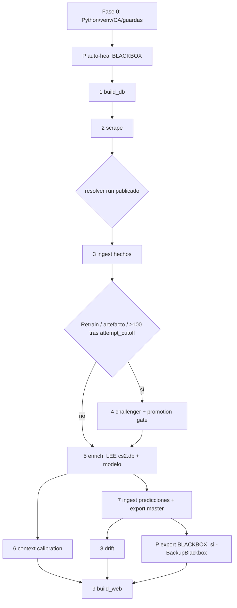

# PIPELINE — `start.ps1` documentada (refactor `feature/pipeline-refactor`)

Orquestador de una sola orden para el dominio CS2. Windows/PowerShell (5.1 y 7).
Entrada real: [`CS2/start.ps1`](../start.ps1); wrapper compatible en la raíz.
Config: [`CS2/PIPELINE/pipeline.config.psd1`](../PIPELINE/pipeline.config.psd1).
Helpers: [`CS2/PIPELINE/pipeline.helpers.ps1`](../PIPELINE/pipeline.helpers.ps1).

## Frescura observable de HLTV

Cada arranque publica `PIPELINE/runs/<run_id>/freshness.json` antes del
enriquecimiento. El umbral se configura en
`PIPELINE/freshness.config.json` (24 horas por defecto). El resumen y la web
muestran la edad del último lote correcto y distinguen
`source_update_failed`, `pipeline_not_run`, `fallback_used` y
`source_not_refreshed`.

Una predicción generada con HLTV obsoleto o fallback conserva la probabilidad
calibrada, pero reduce su `reliability_score`, fuerza nivel de incertidumbre
bajo y añade `DATA_STALE`/`DATA_FALLBACK`. La web recalcula la edad con el reloj
del navegador, por lo que el aviso aparece aunque `data.js` no se regenere.

> **Contrato actual.** `.\start.ps1` entrena si falta el artefacto o cuando se
> acumulan al menos 100 etiquetas posteriores a `attempt_cutoff`;
> `.\start.ps1 -Retrain` fuerza un
> challenger manual. Ningún camino sobrescribe producción sin atravesar la
> misma puerta temporal de promoción. `.\start.ps1 -RollbackModel` restaura el
> último modelo bueno sin ejecutar el pipeline diario.

---

## 1. Etapas y dependencias

| # | Etapa | Script invocado | Se ejecuta si | Exit code al fallar |
|---|---|---|---|---:|
| P | Auto-heal / restore BLACKBOX | `BBDD/blackbox.py autoheal\|restore` | `-not NoDb` | 10 |
| 1 | Init/siembra BBDD | `BBDD/build_db.py` | `-not NoDb` | 4 |
| 2 | Scrape HLTV + pendientes | `PIPELINE/start.py` | `-not SkipScrape` | 3 |
| 3 | Ingest pre-entreno (hechos) | `BBDD/ingest.py` | `-not NoDb` | 4 |
| 4 | Entrenar challenger + puerta de promoción | `MODEL/train.py` | `Retrain`, falta `model.pkl` **o** auto-retrain con ≥100 etiquetas posteriores a `attempt_cutoff` | 5 |
| 5 | Enrich predicciones | `PIPELINE/enrich_predictions.py` | siempre | 6 |
| 6 | Calibración por contexto | `MODEL/analyze_context_calibration.py` | siempre | 7 |
| 7 | Ingest final + export master | `BBDD/ingest.py`, `BBDD/export_master_json.py` | `-not NoDb` | 8 |
| 8 | Monitor drift | `MODEL/monitor_drift.py` | `-not NoDb` | 9 |
| P | Export BLACKBOX | `BBDD/blackbox.py export` | `BackupBlackbox` y `-not NoDb` | 10 |
| 9 | Generar web | `WEB/build_web.py` | siempre | 11 |

Las etapas P (BLACKBOX) son auxiliares y no entran en la numeración `[n/total]`
(se muestran como `[BLACKBOX]`), igual que antes. El total numerado es
**4** (scrape, enrich, contexto, web) **+4** si hay BBDD **+1** si toca entrenar.
La decisión automática se calcula después del ingest de hechos y antes de fijar
si existe esa etapa adicional.



**Ruta crítica:** `build_db → scrape → ingest → (train) → enrich → ingest → {drift, web}`.
El ingest aparece **dos veces a propósito**: el pre-entreno mete *hechos* que
`enrich_predictions.py` lee de `cs2.db` ([enrich_predictions.py:74](../PIPELINE/enrich_predictions.py#L74)),
y el final persiste las *predicciones* + backup + export master. No es duplicado.

---

## 2. Flags

**Comportamiento del run:** `-SkipScrape`, `-AllowOfflineFallback`, `-Retrain`,
`-RollbackModel`, `-NoDb`, `-MaxMatches N`, `-Quiet`. `-RollbackModel` es una
ruta de mantenimiento exclusiva: restaura el puntero `last_good` y termina sin
scrapear, ingerir ni reentrenar. El equivalente directo es
`python MODEL\manage_models.py rollback`.

**Scrape (se traducen a la CLI de `PIPELINE/start.py`):** `-PlayerDelay S`,
`-SkipPlayerStats`, `-SkipTeamProfiles`, `-SkipMatchAssets`, `-MatchAssetsLimit N`,
`-MatchAssetsDelay S`, `-SkipAnalytics`, `-SkipRankings`, `-SkipWarmup`,
`-SkipSameDayRecovery`, `-RecoveryWindowDays N`, `-RecoveryDelay S`,
`-RecreateScraperVenv`.

**BLACKBOX:** `-BackupBlackbox`, `-RestoreBlackbox`, `-SkipAutoHeal`.

**Nuevos (refactor):**
- `-DryRun` / `-WhatIf` — lista las etapas que se ejecutarían sin ejecutar nada
  (incluye el setup: no instala deps ni crea venvs).
- `-LogLevel DEBUG|INFO|WARN|ERROR` — nivel de consola. El JSONL guarda **todo**
  independientemente del nivel.
- `-Config PATH` — usa un `.psd1` de configuración alternativo.

Validación: los numéricos usan `[ValidateRange]` (delays y contadores ≥ 0) y se
avisa de combinaciones sin efecto (`-NoDb` con `-BackupBlackbox`/`-RestoreBlackbox`,
`-SkipScrape` con `-MaxMatches`).

---

## 3. Salidas y logging

- **Transcript** completo: `PIPELINE/logs/start_<ts>.log` (como antes).
- **Log estructurado** (nuevo): `PIPELINE/logs/start_<ts>.jsonl`, una línea JSON
  por evento (`ts`, `level`, `stage`, `message`) — registro completo aunque la
  consola filtre por `-LogLevel`.
- **Tiempos** (nuevo): tabla por etapa al final + `PIPELINE/logs/start_<ts>.timing.json`.
- **Decisión de reentreno:** `PIPELINE/logs/retrain_decision_<ts>.json` registra
  `live_cutoff`, `attempt_cutoff`, etiquetas nuevas estrictamente posteriores al
  segundo, umbral 100 y razón de ejecutar/omitir.
- **Retención:** `PIPELINE/logs/retention_<ts>.json` contiene el preview o la
  aplicación autorizada de registry/runs. Sin aprobación inicial es un no-op.
- **Exit codes** (nuevo): el `trap` propaga el código de la clase de fallo
  (tabla §1). `0` = éxito.

Todo bajo `PIPELINE/logs/` (gitignored). Al terminar, `start.ps1` agrupa esos
ficheros por timestamp y conserva exclusivamente la ejecución actual y la
anterior; un fallo de rotación avisa sin ocultar el resultado de la pipeline.

---

## 4. Auto-heal de BLACKBOX (cableado)

La fase **P** corre **antes de la etapa 1 (build_db)**, solo con `-not NoDb`:
- `-RestoreBlackbox` → restauración explícita (con guardián/--force).
- si no, y sin `-SkipAutoHeal` → `blackbox.py autoheal`: si `cs2.db`
  falta/vacía/corrupta y hay un BLACKBOX válido, la restaura antes de seguir;
  si está sana, no hace nada. Nunca aborta la pipeline. Ver
  [RECOVERY.md](RECOVERY.md) y [CS2/BBDD/BLACKBOX/README.md](../BBDD/BLACKBOX/README.md).

---

## 5. Config-driven

[`pipeline.config.psd1`](../PIPELINE/pipeline.config.psd1) centraliza lo que
antes estaba hardcodeado en `start.ps1`:
- `ScrapeGuards` — ~26 variables `HLTV_*`/`BBDD_*` (rate limit, backoff, circuit
  breaker, cuarentena, TTLs, stealth). Se publican con `Set-DefaultEnv` (no pisan
  lo ya definido en el proceso).
- `requirements.txt` + `requirements.lock.txt` de cada componente — única
  declaración y cierre reproducible; `Ensure-*Python` no usa listas de la config.
- `ExitCodes` — mapa de códigos por clase de fallo.

Los umbrales de ML no viven en el wrapper PowerShell. `MODEL/config.yaml`
centraliza `promotion` (100 filas comunes, epsilon log loss `0.001`, desempate
Brier `0.0005` y auto-retrain cada 100 etiquetas posteriores a `attempt_cutoff`)
y `retention` (solo `latest` + `last_good`, y los 2 runs no referenciados
más recientes). Los runs citados por SQLite o `master` se conservan como
evidencia de procedencia y no se confunden con versiones descartables.

Editar la config **no requiere tocar código**. `-Config <ruta>` permite perfiles.

---

## 6. Elementos eliminados / relocalizados

| Elemento | Acción | Motivo |
|---|---|---|
| Variable `$baseOk` | **ELIMINADA** | Se calculaba y nunca se usaba (código muerto). |
| Guardas `HLTV_*`/`BBDD_*` (30 `Set-DefaultEnv`) | **Movidas a config** | Config-driven; no borradas. |
| `Get-*Python`, `Ensure-*`, `Invoke-Native`, `Test-PythonImports`, `Set-DefaultEnv`, `Configure-ScrapeGuards` | **Movidas a helpers** | Reutilización y test; no borradas. |
| `Step` (función de progreso) | **Sustituida** por `Invoke-Stage` | Añade timing/dry-run/exit-code. |
| Doble `ingest.py` | **CONSERVADO** | No es redundante (§1): hechos pre-enrich vs predicciones post-enrich. |
| Ruta legacy `--history`/`--raw`, scripts manuales (`analyze_failures.py`, `backtest_all_available.py`, …) | **INTACTOS** | Fuera del alcance de la pipeline; son herramientas, no muertos. |

No se eliminó nada más durante aquel refactor. El contrato posterior sí añadió
la decisión automática por 100 etiquetas posteriores a `attempt_cutoff`, sin
alterar la semántica manual de `-Retrain`: ambos generan un challenger y pasan
por la misma puerta.

---

## 6bis. Puerta de modelo, rollback y poda segura

La versión registrada y la copia usada en inferencia tienen responsabilidades
distintas:

- `MODEL/artifacts/registry/<timestamp>/` contiene cada versión completa.
- `registry/latest.json` señala el vivo validado.
- `registry/last_good.json` señala al incumbente saliente de la última promoción.
- `MODEL/artifacts/model.pkl` es exclusivamente la copia runtime; se reemplaza
  atómicamente y su SHA-256 debe coincidir con `latest`.

El planificador distingue dos cortes. `live_cutoff = incumbent.metadata.date_max`
es inmutable mientras siga vivo ese modelo y delimita la comparación de promoción.
`attempt_cutoff = max(live_cutoff, último intento terminal válido registrado)`
solo programa el siguiente auto-retrain: exige 100 etiquetas con fecha
estrictamente posterior y evita repetir un challenger ya rechazado o aplazado.

`recipe_mask` contiene solo filas `<= live_cutoff`. Dentro de ese prefijo se
congelan las features, la familia `best_name`, Optuna purgado y los pesos de
componentes, y se ajusta una única instancia shadow. Esa instancia predice de una
vez todo el sufijo `> live_cutoff`: no hay refits entre partidos ni se entregan
etiquetas del sufijo al ajuste. Las etiquetas se usan después para comparar el
shadow fijo y el incumbente sobre exactamente las mismas filas point-in-time e
IDs. No intervienen aquí las predicciones walk-forward post-corte del barrido
diagnóstico.

Con menos de 100 filas comunes la promoción se aplaza. Con muestra suficiente,
log loss es la métrica primaria: se exige mejora de al menos `0.001`; dentro de
la banda ±`0.001`, solo una mejora Brier de al menos `0.0005` desempata a favor
del challenger. El resultado informa `n`, cutoff, log loss/Brier de ambos, deltas
y razón. Rechazo o aplazamiento no cambian ninguno de los dos punteros ni
`model.pkl`.

La decisión persiste dos huellas distintas. `holdout_sha256` fija IDs, fechas y
etiquetas del emparejamiento; `prediction_sha256` añade las probabilidades del
incumbente y del shadow para que los números puedan auditarse byte a byte. Si no
hay muestra suficiente para predecir, la segunda huella queda vacía.

La misma receta congelada se refitea sobre todo el histórico. Ese cálculo puede
prepararse antes de materializar la decisión porque no entra en las predicciones
del shadow; únicamente se publica si el shadow gana. La métrica de promoción
valida el shadow as-of, **no** el pickle full-history resultante. El health gate
final carga directamente `registry/<version>/model.pkl`. La
`candidate_reference` canónica verifica su SHA-256, y exactamente ese hash se
entrega como `expected_candidate_sha256` obligatorio al CAS.

El bundle núcleo (`model.pkl`, metadata, SHAP, manifest y config) se prepara en un
directorio staging oculto y un único `os.replace` lo convierte en
`registry/<timestamp>/`. El destino debe ser nuevo y esos archivos quedan
inmutables. `promotion_decision.json` y `deployment.json` son sidecars auditables
**aditivos** sancionados: pueden incorporarse después, pero no reescriben el
bundle núcleo ni cambian el SHA del modelo. Por eso la metadata conserva la decisión
pre-commit (`promotion_approved`) y, si fue aprobada,
`deployment_state=pending_pointer_commit`; no es evidencia suficiente de
publicación. El publish real se confirma con `latest.json`, el hash de la copia
runtime y `deployment.json`.

La mutación se serializa con `registry/.deployment.lock`. Bajo ese lock se releen
los punteros y se hace CAS de versión+SHA del incumbente evaluado y SHA del
challenger registrado; cualquier cambio concurrente aborta sin mutación. La API
no admite omitir las expectativas: promoción exige `expected_incumbent` y
`expected_candidate_sha256`, y bootstrap exige el SHA esperado del candidato.
Tras un commit correcto, `deployment.json` registra resultado, referencias y
hashes, incluidos `decision_holdout_sha256` y `decision_prediction_sha256`. Si
falla ese recibo posterior se advierte sin revertir
el despliegue; la autoridad operativa sigue siendo `latest.json` junto con el
hash de `MODEL/artifacts/model.pkl`.

Al promocionar, el incumbente pasa a `last_good`, el challenger a `latest` y su
artefacto se publica como `model.pkl`. El rollback hace la rotación inversa:

```powershell
.\start.ps1 -RollbackModel
python MODEL\manage_models.py rollback
```

Un puntero legado se corrige exclusivamente con
`manage_models.py set-last-good --version <ID> --expected-sha256 <SHA>`: carga el
artefacto y aplica lock/CAS sin alterar `latest` ni el runtime.

La poda nunca es una eliminación ciega. El registry conserva exactamente
`latest` y `last_good` (`registry_keep=0`). Los runs conservan los 2 últimos no referenciados, el
`master.last_run_id`, cualquier run referenciado por contratos persistentes y
todos los directorios no canónicos/desconocidos. Antes de la **primera** poda se
debe mostrar la keep-list/delete-list y su token al operador; solo una
confirmación explícita de ese token crea la aprobación. La aplicación recalcula
el plan justo antes de borrar: si cambió el filesystem, el token queda obsoleto y
se exige otro preview. Las podas automáticas posteriores solo son válidas mientras
coincidan versión de política, tipo y valor de N con la aprobación guardada.
Antes de borrar, todos los bundles se mueven mediante rename atómico a
`.retention-quarantine/<TOKEN>/`. Un fallo en staging revierte todos los renames;
un fallo posterior de `rmtree` deja únicamente quarantine recuperable y emite un
reporte estructurado. Se reintenta con
`manage_models.py prune --scope registry --resume <TOKEN>` después de corregir la
causa, nunca restaurando manualmente un bundle parcial a un nombre canónico.
Los estados anteriores al borrado hacen rollback idempotente tras validar XOR y
fingerprint; los estados de borrado continúan desde quarantine después de volver
a validar punteros, SHA de bundles y runtime. Una quarantine pendiente bloquea
explícitamente nuevos confirms y `--auto` con `recovery_required`.
En Windows, `ReadOnly` se elimina recursivamente solo dentro de quarantine y
después del staging completo, antes de `rmtree`.
Al final de un run normal, `start.ps1` ejecuta
`manage_models.py prune --scope all --auto`: antes de esa aprobación devuelve el
preview/no-op; después solo aplica un plan aún compatible.

La aprobación inicial se hace desde `CS2/`, copiando literalmente los tokens del
JSON emitido por el primer comando:

```powershell
python MODEL\manage_models.py prune --scope all
python MODEL\manage_models.py prune --scope all --confirm "registry=<TOKEN_REGISTRY>,runs=<TOKEN_RUNS>"
```

---

## 7. Sobre la paralelización (por qué no se añadió)

Las etapas 6 (contexto, read-only) y 8 (drift, read-only) parecían paralelizables,
pero **la 6 corre antes del ingest final y la 8 después**, con una escritura de
BBDD en medio: solaparlas cambiaría sus entradas. Priorizando "no romper
comportamiento", se mantiene el orden secuencial. El coste real está dentro de
`PIPELINE/start.py` (scraping, ya concurrente internamente) y `MODEL/train.py`
(CPU), no en el orquestador PowerShell.

---

## 8. Tiempos antes/después

**Limitación honesta:** el end-to-end real (scrape + train) **no es medible en el
entorno de desarrollo** (sin `cs2.db`, sin acceso a HLTV, sin dependencias ML,
Python 3.14). Lo medible aquí:

| Métrica | Antes | Después | Nota |
|---|---:|---:|---|
| Parse del script (`ParseFile`) | ~20.7 ms | ~3.1 ms | Ambos negligibles; la diferencia es sobre todo warmup JIT, **no** una mejora real de velocidad. |
| Dry-run end-to-end (9 etapas) | — (no existía) | ~0.4 s | El script anterior no tenía `-DryRun`. |
| Overhead de orquestación por etapa | — | < 1 ms | `Invoke-Stage` (timing + log). |

**Para medir el end-to-end real en tu máquina** (el refactor lo instrumenta solo):

```powershell
cd CS2
.\start.ps1 -Retrain            # escribe PIPELINE\logs\start_<ts>.timing.json
Get-Content .\PIPELINE\logs\start_*.timing.json | Select-Object -Last 1
```

El `timing.json` trae los segundos por etapa; compáralo con una rama base
haciendo `git stash`/checkout del `start.ps1` anterior. Si me pasas una `cs2.db`,
lo mido aquí con `.\start.ps1 -SkipScrape -Retrain`.

> El refactor **no busca acelerar** el trabajo pesado (scrape/train viven en
> Python); busca hacer la orquestación más profesional, observable y mantenible.
> La ganancia práctica de tiempo está en `-DryRun` (validar en < 1 s sin ejecutar)
> y en el `timing.json` (localizar el cuello de botella real).

---

*Documento originado en `feature/pipeline-refactor` y actualizado con el contrato
de promoción, rollback y retención; ver §6bis.*
