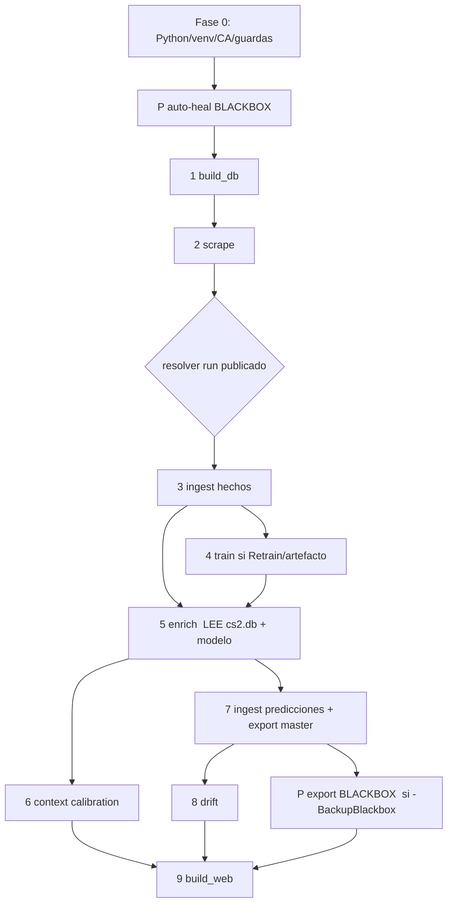

# PIPELINE — `start.ps1` documentada (refactor `feature/pipeline-refactor`)

Orquestador de una sola orden para el dominio CS2. Windows/PowerShell (5.1 y 7).
Entrada real: [`CS2/start.ps1`](../start.ps1); wrapper compatible en la raíz.
Config: [`CS2/PIPELINE/pipeline.config.psd1`](../PIPELINE/pipeline.config.psd1).
Helpers: [`CS2/PIPELINE/pipeline.helpers.ps1`](../PIPELINE/pipeline.helpers.ps1).

> **Comportamiento preservado.** `.\start.ps1` (entrena solo si falta el
> artefacto) y `.\start.ps1 -Retrain` (fuerza entrenamiento) se comportan
> exactamente igual que antes. Mismas etapas, mismo orden, mismos scripts y
> argumentos. El refactor añade estructura, no cambia el flujo.

---

## 1. Etapas y dependencias

| # | Etapa | Script invocado | Se ejecuta si | Exit code al fallar |
|---|---|---|---|---:|
| P | Auto-heal / restore BLACKBOX | `BBDD/blackbox.py autoheal\|restore` | `-not NoDb` | 10 |
| 1 | Init/siembra BBDD | `BBDD/build_db.py` | `-not NoDb` | 4 |
| 2 | Scrape HLTV + pendientes | `PIPELINE/start.py` | `-not SkipScrape` | 3 |
| 3 | Ingest pre-entreno (hechos) | `BBDD/ingest.py` | `-not NoDb` | 4 |
| 4 | Entrenar modelo | `MODEL/train.py` | `Retrain` **o** falta `model.pkl` | 5 |
| 5 | Enrich predicciones | `PIPELINE/enrich_predictions.py` | siempre | 6 |
| 6 | Calibración por contexto | `MODEL/analyze_context_calibration.py` | siempre | 7 |
| 7 | Ingest final + export master | `BBDD/ingest.py`, `BBDD/export_master_json.py` | `-not NoDb` | 8 |
| 8 | Monitor drift | `MODEL/monitor_drift.py` | `-not NoDb` | 9 |
| P | Export BLACKBOX | `BBDD/blackbox.py export` | `BackupBlackbox` y `-not NoDb` | 10 |
| 9 | Generar web | `WEB/build_web.py` | siempre | 11 |

Las etapas P (BLACKBOX) son auxiliares y no entran en la numeración `[n/total]`
(se muestran como `[BLACKBOX]`), igual que antes. El total numerado es
**4** (scrape, enrich, contexto, web) **+4** si hay BBDD **+1** si toca entrenar.



**Ruta crítica:** `build_db → scrape → ingest → (train) → enrich → ingest → {drift, web}`.
El ingest aparece **dos veces a propósito**: el pre-entreno mete *hechos* que
`enrich_predictions.py` lee de `cs2.db` ([enrich_predictions.py:74](../PIPELINE/enrich_predictions.py#L74)),
y el final persiste las *predicciones* + backup + export master. No es duplicado.

---

## 2. Flags

**Comportamiento del run:** `-SkipScrape`, `-AllowOfflineFallback`, `-Retrain`,
`-NoDb`, `-MaxMatches N`, `-Quiet`.

**Scrape (se traducen a la CLI de `PIPELINE/start.py`):** `-PlayerDelay S`,
`-SkipPlayerStats`, `-SkipTeamProfiles`, `-SkipMatchAssets`, `-MatchAssetsLimit N`,
`-MatchAssetsDelay S`, `-SkipAnalytics`, `-SkipRankings`, `-SkipWarmup`,
`-SkipSameDayRecovery`, `-RecoveryWindowDays N`, `-RecoveryDelay S`,
`-RecreateScraperVenv`.

**BLACKBOX:** `-BackupBlackbox`, `-RestoreBlackbox`, `-SkipAutoHeal`.

**Nuevos (refactor):**
- `-DryRun` / `-WhatIf` — lista las etapas que se ejecutarían sin ejecutar nada
  (incluye el setup: no instala deps ni crea venvs).
- `-LogLevel DEBUG|INFO|WARN|ERROR` — nivel de consola. El JSONL guarda **todo**
  independientemente del nivel.
- `-Config PATH` — usa un `.psd1` de configuración alternativo.

Validación: los numéricos usan `[ValidateRange]` (delays y contadores ≥ 0) y se
avisa de combinaciones sin efecto (`-NoDb` con `-BackupBlackbox`/`-RestoreBlackbox`,
`-SkipScrape` con `-MaxMatches`).

---

## 3. Salidas y logging

- **Transcript** completo: `PIPELINE/logs/start_<ts>.log` (como antes).
- **Log estructurado** (nuevo): `PIPELINE/logs/start_<ts>.jsonl`, una línea JSON
  por evento (`ts`, `level`, `stage`, `message`) — registro completo aunque la
  consola filtre por `-LogLevel`.
- **Tiempos** (nuevo): tabla por etapa al final + `PIPELINE/logs/start_<ts>.timing.json`.
- **Exit codes** (nuevo): el `trap` propaga el código de la clase de fallo
  (tabla §1). `0` = éxito.

Todo bajo `PIPELINE/logs/` (gitignored).

---

## 4. Auto-heal de BLACKBOX (cableado)

La fase **P** corre **antes de la etapa 1 (build_db)**, solo con `-not NoDb`:
- `-RestoreBlackbox` → restauración explícita (con guardián/--force).
- si no, y sin `-SkipAutoHeal` → `blackbox.py autoheal`: si `cs2.db`
  falta/vacía/corrupta y hay un BLACKBOX válido, la restaura antes de seguir;
  si está sana, no hace nada. Nunca aborta la pipeline. Ver
  [RECOVERY.md](RECOVERY.md) y [CS2/BBDD/BLACKBOX/README.md](../BBDD/BLACKBOX/README.md).

---

## 5. Config-driven

[`pipeline.config.psd1`](../PIPELINE/pipeline.config.psd1) centraliza lo que
antes estaba hardcodeado en `start.ps1`:
- `ScrapeGuards` — ~26 variables `HLTV_*`/`BBDD_*` (rate limit, backoff, circuit
  breaker, cuarentena, TTLs, stealth). Se publican con `Set-DefaultEnv` (no pisan
  lo ya definido en el proceso).
- `ModelImports` / `ModelPipPackages` / `Scraper*Imports` — deps a verificar/instalar.
- `ExitCodes` — mapa de códigos por clase de fallo.

Editar la config **no requiere tocar código**. `-Config <ruta>` permite perfiles.

---

## 6. Elementos eliminados / relocalizados

| Elemento | Acción | Motivo |
|---|---|---|
| Variable `$baseOk` | **ELIMINADA** | Se calculaba y nunca se usaba (código muerto). |
| Guardas `HLTV_*`/`BBDD_*` (30 `Set-DefaultEnv`) | **Movidas a config** | Config-driven; no borradas. |
| `Get-*Python`, `Ensure-*`, `Invoke-Native`, `Test-PythonImports`, `Set-DefaultEnv`, `Configure-ScrapeGuards` | **Movidas a helpers** | Reutilización y test; no borradas. |
| `Step` (función de progreso) | **Sustituida** por `Invoke-Stage` | Añade timing/dry-run/exit-code. |
| Doble `ingest.py` | **CONSERVADO** | No es redundante (§1): hechos pre-enrich vs predicciones post-enrich. |
| Ruta legacy `--history`/`--raw`, scripts manuales (`analyze_failures.py`, `backtest_all_available.py`, …) | **INTACTOS** | Fuera del alcance de la pipeline; son herramientas, no muertos. |

No se eliminó nada más. Ningún cambio de comportamiento (el `#6` de la auditoría
—saltar reentreno sin datos nuevos— se descartó para no alterar `-Retrain`).

---

## 7. Sobre la paralelización (por qué no se añadió)

Las etapas 6 (contexto, read-only) y 8 (drift, read-only) parecían paralelizables,
pero **la 6 corre antes del ingest final y la 8 después**, con una escritura de
BBDD en medio: solaparlas cambiaría sus entradas. Priorizando "no romper
comportamiento", se mantiene el orden secuencial. El coste real está dentro de
`PIPELINE/start.py` (scraping, ya concurrente internamente) y `MODEL/train.py`
(CPU), no en el orquestador PowerShell.

---

## 8. Tiempos antes/después

**Limitación honesta:** el end-to-end real (scrape + train) **no es medible en el
entorno de desarrollo** (sin `cs2.db`, sin acceso a HLTV, sin dependencias ML,
Python 3.14). Lo medible aquí:

| Métrica | Antes | Después | Nota |
|---|---:|---:|---|
| Parse del script (`ParseFile`) | ~20.7 ms | ~3.1 ms | Ambos negligibles; la diferencia es sobre todo warmup JIT, **no** una mejora real de velocidad. |
| Dry-run end-to-end (9 etapas) | — (no existía) | ~0.4 s | El script anterior no tenía `-DryRun`. |
| Overhead de orquestación por etapa | — | < 1 ms | `Invoke-Stage` (timing + log). |

**Para medir el end-to-end real en tu máquina** (el refactor lo instrumenta solo):

```powershell
cd CS2
.\start.ps1 -Retrain            # escribe PIPELINE\logs\start_<ts>.timing.json
Get-Content .\PIPELINE\logs\start_*.timing.json | Select-Object -Last 1
```

El `timing.json` trae los segundos por etapa; compáralo con una rama base
haciendo `git stash`/checkout del `start.ps1` anterior. Si me pasas una `cs2.db`,
lo mido aquí con `.\start.ps1 -SkipScrape -Retrain`.

> El refactor **no busca acelerar** el trabajo pesado (scrape/train viven en
> Python); busca hacer la orquestación más profesional, observable y mantenible.
> La ganancia práctica de tiempo está en `-DryRun` (validar en < 1 s sin ejecutar)
> y en el `timing.json` (localizar el cuello de botella real).

---

*Refactor en `feature/pipeline-refactor`. Sin cambios de comportamiento; ver §6.*
