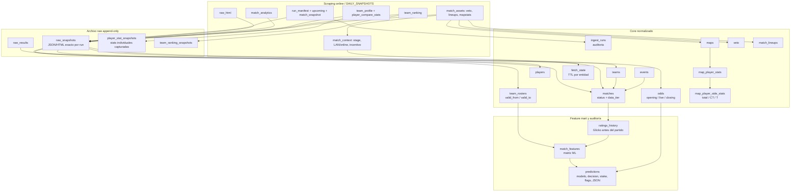
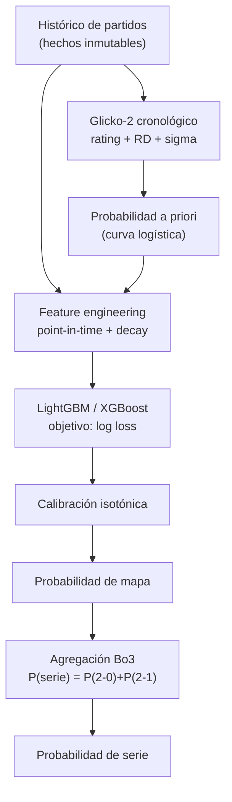

# CS2 Match Prediction — Especificación Técnica del Proyecto

**Proyecto académico de predicción de resultados de partidos profesionales de Counter-Strike 2 a partir de datos de HLTV.**

*Última validación del documento: julio de 2026 · Era de datos objetivo: CS2 (desde octubre de 2023).*

---

## 0. Cómo leer este documento

Este es el documento de diseño de referencia del proyecto. Define **qué** se construye, **por qué** se toma cada decisión y **cómo** se garantiza que el modelo sea fiable y reproducible. Está pensado para que cualquiera (o una herramienta como Claude Code) pueda retomar el trabajo con el contexto completo.

Las decisiones marcadas con `[ABIERTO: …]` son las que aún dependen de tu criterio y conviene cerrar explícitamente antes de avanzar.

El principio que gobierna todo el proyecto, y que conviene tener presente en cada sección:

> La base de datos guarda **la verdad de lo que pasó, con su sello de tiempo**. Las features y los ratings son **vistas calculadas** sobre esa verdad, reconstruibles a cualquier instante del pasado. Si se respeta esa separación, el "cero fuga temporal" deja de ser algo que se vigila a mano y pasa a estar garantizado por el diseño.

---

## 0.1. Glosario rápido

- **Snapshot:** captura congelada de los datos disponibles en un momento concreto: partido, cuotas, estadísticas de jugadores, rankings, Analytics, etc. Sirve para guardar lo que se sabía entonces, aunque HLTV o las casas cambien o borren información después. Es la pieza clave para backups, auditoría y entrenamiento sin fuga temporal.
- **Glicko / Glicko-2:** sistema de rating parecido a Elo, pero más profesional para este caso porque no solo estima la fuerza de un equipo, sino también la incertidumbre de esa estimación mediante RD (*rating deviation*) y volatilidad. Un equipo con pocos partidos puede tener buen rating, pero si su RD es alta el sistema reconoce que hay poca confianza.
- **Tener Glicko a favor:** significa que, antes del partido, el rating Glicko del equipo es superior al del rival. En la web se interpreta como una ventaja estadística histórica: cuanto mayor sea la diferencia y menor la incertidumbre, más fuerte es la señal. No significa victoria garantizada.
- **Log loss:** métrica para evaluar probabilidades, no solo aciertos/fallos. Premia probabilidades bien calibradas y penaliza mucho las predicciones confiadas que fallan. Por ejemplo, fallar diciendo 90 % es bastante peor que fallar diciendo 55 %. En betting es más útil que mirar solo accuracy, porque el valor esperado depende de la calidad de la probabilidad.

---

## 1. Objetivo y alcance

### 1.1. Objetivo

Estimar, **antes de que empiece un partido**, la probabilidad de que cada equipo gane la **serie** (Best-of-3), a partir de información histórica disponible en HLTV.

El entregable no es una etiqueta binaria sino una **probabilidad bien calibrada**: cuando el modelo dice 70 %, el favorito debe ganar aproximadamente el 70 % de las veces.

### 1.2. Prioridades del modelo (en orden, según decisión del autor)

1. Máxima exactitud (accuracy).
2. Probabilidades bien calibradas.
3. Interpretabilidad (entender qué pesa).
4. Capacidad de batir las cuotas de las casas.

> **Nota metodológica importante.** Las prioridades 1 y 2 no son independientes en este problema. Un modelo se entrena minimizando *log loss*, lo que produce buena calibración **y** buena exactitud de forma conjunta. Optimizar la exactitud de forma directa empuja al modelo a elegir siempre al favorito y a tirar la información probabilística. Por tanto se tratan como un objetivo conjunto, no como una jerarquía estricta.

### 1.3. Alcance de datos

- **Formato objetivo:** serie Bo3 (formato dominante en el circuito).
- **Cobertura:** todos los tiers, incluido online. Esta elección amplía la cobertura y hace más interesante la evaluación (el baseline "elige al favorito" es más débil), pero introduce ruido y exige tratar explícitamente la incertidumbre y la integridad competitiva (ver §6 y §7).

### 1.4. Fuera de alcance (por ahora)

- Predicción de win probability **en vivo, por ronda** (requiere parsear demos, no datos de HLTV; ver §11).
- Predicción de mercados de propuesta (props), kills individuales, etc.
- Cualquier uso con fines de apuesta real; el proyecto es académico.

---

## 2. Formulación del problema

### 2.1. Es clasificación supervisada, no aprendizaje por refuerzo

El problema es: *dado un vector de features conocidas antes del partido, predecir una etiqueta probabilística de victoria*. Esto es **clasificación binaria supervisada** sobre datos tabulares.

**No se usa Deep Reinforcement Learning (DRL).** DRL resuelve problemas de **decisión secuencial**: un agente toma acciones en un entorno para maximizar una recompensa acumulada. Predecir un resultado no tiene agente, ni espacio de acciones, ni entorno con el que interactuar. Forzar DRL aquí añade complejidad, multiplica la necesidad de datos, hace la validación casi imposible y rinde peor que un modelo tabular bien ajustado.

> **Dónde sí cabría RL (fuera del alcance principal):** modelar la **decisión de veto** (qué mapa pickear/banear) como un problema de bandits o decisión secuencial. Eso es optimización de decisiones, no predicción de resultados, y se deja como posible extensión.

### 2.2. Dos problemas que no hay que confundir

| | **Pre-partido (este proyecto)** | **Win probability en vivo** |
|---|---|---|
| Entrada | Datos agregados de HLTV | Estado de ronda (HP, equipamiento, jugadores vivos, tiempo) |
| Fuente | Web de HLTV | Demos parseados |
| Tarea | ¿Quién gana la serie? | ¿Quién gana la ronda? |
| Modelo de referencia | Sistemas de rating + GBM | XGBoost sobre eventos de ronda |

La literatura fundacional de win probability (Xenopoulos et al.) resuelve la columna derecha; sus features clave (valor de equipamiento, HP) **no existen** en datos agregados de HLTV. No se debe copiar ese enfoque para este problema.

---

## 3. Trabajo relacionado

Resumen de la literatura relevante (referencias completas en §13):

- **Xenopoulos et al. (2020), win probability con XGBoost.** Modelo de probabilidad de victoria por ronda entrenado sobre decenas de millones de eventos de juego. Hallazgo central: el valor del equipamiento del equipo es el principal determinante de ganar una ronda, por encima incluso del número de jugadores vivos. Relevante como referencia conceptual, pero resuelve el problema *en vivo*, no el pre-partido.
- **Björklund et al. (2018).** Predicción a partir de composición de equipo y clustering de roles + red neuronal sobre demos.
- **Makarov et al. (2017).** Enfoque clásico con regresión logística.
- **Estudio comparativo con TrueSkill (IEEE).** Comparó árboles de decisión, gradient boosting, XGBoost, regresión logística y redes neuronales; XGBoost y la red neuronal rindieron mejor, sin diferencia significativa entre ambos, y la introducción de valores TrueSkill mejoró ligeramente todos los algoritmos. Conclusión práctica: **la red neuronal no supera a XGBoost en datos tabulares**, y el sistema de rating es la pieza más valiosa.
- **Interpretabilidad con SHAP (2025).** Uso de machine learning interpretable con valores SHAP para analizar el rendimiento de jugadores profesionales de Counter-Strike.

**Síntesis:** el estado del arte para predicción tabular pre-partido es **gradient boosting + un buen sistema de rating como feature**, con calibración y validación temporal rigurosa.

---

## 4. Datos

### 4.1. Fuente: HLTV

HLTV es la fuente canónica de resultados, ratings y rankings. Consideraciones de obtención:

- La web renderiza contenido en servidor y está protegida con Cloudflare, que bloquea peticiones automatizadas. El scraping directo ingenuo no funciona.
- Herramientas viables: el paquete `hltv` de npm; scrapers en Python basados en `undetected-chromedriver` o Camoufox (sortean Cloudflare con fingerprinting TLS/JA3); actores de Apify; el endpoint de la API móvil (más estable que el HTML).
- **Disciplina obligatoria:** respetar rate limits, cachear de forma agresiva (no re-scrapear nunca lo ya descargado) y operar a bajo volumen. El scraping va contra los ToS de HLTV; para un proyecto académico personal de bajo volumen suele tolerarse, pero se opera con consideración hacia sus servidores.
- Evaluar datasets ya publicados (p. ej. Kaggle) para arrancar sin scraping inicial.

`[ABIERTO: elegir la herramienta concreta de scraping y dejarla fijada para reproducibilidad.]`

### 4.2. Alcance temporal y rupturas de régimen

El corte natural de inicio es el **lanzamiento de CS2 (octubre de 2023)**, por una ruptura de régimen dura: el cambio a **MR12** alteró la economía, el número de rondas y el valor de "salvar". Mezclar CS:GO con CS2 sin marcarlo contamina el dataset.

Rupturas de régimen a tener en cuenta:

| Evento | Fecha | Efecto |
|---|---|---|
| CS:GO → CS2 (MR12) | oct. 2023 | Cambia la dinámica del juego entero |
| HLTV Rating 2.1 | oct. 2024 | Recalibra medias a 1.00; ajusta CS2 (asistencias 41→26 de daño) |
| HLTV Rating 3.0 | ago. 2025 | Mayor revisión desde 2017; añade ajuste económico y *Round Swing* |
| Reajuste Rating 3.0 | oct. 2025 | Devuelve peso a kills y daño |
| Rotaciones del pool de mapas | periódicas (Valve) | Cambian qué mapas se juegan |

**Decisión recomendada:** entrenar **solo con la era CS2** para el modelo principal. Incluir CS:GO solo como estudio de ablación, siempre con un flag de era explícito.

### 4.3. Consistencia de los ratings

La fórmula de rating de HLTV ha cambiado (2.0 → 2.1 → 3.0). La buena noticia: HLTV **recalculó todos los partidos históricos** bajo la fórmula 3.0, así que scrapear *ahora* devuelve ratings homogéneos. Aun así, por robustez:

- Apoyarse también en **stats crudas** (ADR, KAST, KPR, DPR), cuyas definiciones son estables.
- **Nunca** mezclar ratings extraídos en fechas distintas bajo fórmulas distintas.

### 4.4. Modelo de datos (estado implementado en SQLite)

**Estado actual (2026-07-07):** `BBDD/cs2.db` es una fuente de verdad viva. `BBDD/build_db.py` crea/migra el esquema y siembra el historico solo si `matches` esta vacia; `BBDD/ingest.py` aplica cada run con upserts incrementales; `BBDD/export_master_json.py` genera el `master/matches.json` de compatibilidad desde SQLite. La ejecucion normal no borra ni reconstruye desde cero, para no perder odds, stats individuales ni snapshots que puedan cambiar en HLTV o en las casas.

Definición: `BBDD/cs2_prediction_schema.sql`. Constructor reproducible: `BBDD/build_db.py`. BBDD física: `BBDD/cs2.db`, con backups en `BBDD/backups/` y espejo en `CS2-Predictor-Backups/`.

La BBDD separa tres cosas que no deben mezclarse:

1. **Archivo raw append-only:** lo que HLTV/odds devolvió exactamente en cada run, con timestamp y fichero fuente.
2. **Hechos normalizados:** partidos, mapas, veto, alineaciones, odds, rosters y box scores.
3. **Features/predicciones point-in-time:** lo calculado antes del partido, auditable y reconstruible.



Tablas clave y qué preservan:

- `matches`: separa `status` (`scheduled`, `pending_result`, `completed`) y `data_tier` (`historical_seed`, `prematch_captured`, `completed`). Los campos PRE-MATCH (`prematch_captured_at_utc`, odds, contexto, snapshots y flags de cobertura) no se pisan con consultas futuras; cuando llega el resultado solo se rellena el bloque RESULT (`winner_team_id`, `score_t1`, `score_t2`, `result_filled_at_utc`).
- `fetch_state`: TTL compartido por entidad para evitar rescrapear lo fresco: perfiles de equipo 7 dias, stats de jugador 3 dias, rankings 7 dias y assets/Analytics casi permanentes si ya se capturaron correctamente. Estados `blocked`/`error` se reintentan pronto. `DAILY_SNAPSHOTS/start.py` consulta esta tabla antes de pedir perfiles, stats, rankings, assets o Analytics.
- `ingest_runs`: auditoria de cada run aplicado a SQLite: `run_id`, inicio/fin, estado, filas upserted y requests saltadas por frescura.
- `raw_snapshots`: snapshots exactos de `run_manifest`, `upcoming_matches`, `match_snapshot`, `team_profile`, `player_compare_stats`, `predictions_enriched`, `match_assets`, `match_analytics`, `team_ranking`, `raw_html` y `data_quality_report`. Es el seguro contra que HLTV cambie o borre información después.
- `matches.stage`, `matches.environment`, `matches.stage_detail`, `matches.incentive_label`, `matches.high_stakes`, `matches.opening_match`, `matches.winner_advances`, `matches.loser_eliminated`, `matches.bracket` y `matches.context_json`: contexto parseado del bloque `Maps` de HLTV. Guarda LAN/online, fase (group/swiss/playoff/etc.), detalle textual ("Winner advances...", "elimination match", Swiss record), flags consultables y el JSON completo para auditoría.
- `player_stat_snapshots`: stats individuales capturadas en el run pre-partido desde `/stats/players/compare` y el perfil `/stats/players/{id}/{slug}`: jugador HLTV, `time_filter` elegido de forma adaptativa (`past3months` si tiene muestra suficiente; si no `past6months`; si no `past12months`), rating, KPR, DPR, APR, KAST, Impact, ADR, Round Swing, multi-kill rating, AWP KPR, HS %, opening KPR/DPR, flash assists y `payload_json` completo. Esto conserva las stats **tal como estaban disponibles en ese momento**.
- `map_player_stats` y `map_player_side_stats`: box score real por jugador/mapa y por lado `total`/`ct`/`t` cuando el partido ya tiene assets/mapstats. Es la fuente granular para recalcular forma L5/L10/L20 sin consultar páginas históricas cambiantes.
- `team_rosters`: pertenencia temporal real por jugador/equipo (`valid_from`, `valid_to`, `source_run_id`, `source_signature`). Un jugador no "es" de un equipo: estuvo en él durante un intervalo observado.
- `prematch_lineup_snapshots`: announced pre-match lineup with capture time, player, team, and stand-in marker. It is intentionally separate from `match_lineups`, the actual lineup after mapstats.
- `match_analytics_snapshots`, `match_analytics_map_stats`, and `match_analytics_map_handicap`: point-in-time Analytics Center data: map first pick/ban, win rate and sample; BO3 distribution, overtime, round margins, core/stand-in signals, and event metadata. Raw HTML and `payload_json` remain available for audit.
- `events`: stores HLTV event ID, prize pool, teams competing, and source provenance. A scheduled match can update corrected participants, time, or stage without rewriting any historical snapshot.
- `odds`: cuotas por bookmaker y timestamp, separando `opening`, `live` y `closing`. La apertura sirve para benchmark y EV; el cierre se guarda para auditoría, no como feature pre-partido.
- `predictions`: congela la probabilidad pura (`prob_team1`), la probabilidad operativa (`decision_prob_team1`), fiabilidad, peso de mercado, política, favorito, cuota mínima de value (`decision_min_value_odds`, `team1_min_value_odds`, `team2_min_value_odds`), contexto normalizado (`context_environment`, `context_stage`, `context_stage_detail`, `context_incentive_label`, `context_high_stakes`, `context_winner_advances`, `context_loser_eliminated`, `context_opening_match`, `context_bracket`, `context_json`) y los JSON completos de `prediction`, `features`, `odds`, `staking`, `controls`, `flags`, `data_quality` y `rosters`.

Flujo operativo de la BBDD viva:

1. `start.ps1` inicializa/migra `BBDD/cs2.db` con `BBDD/build_db.py` antes del scrapeo.
2. `DAILY_SNAPSHOTS/start.py` consulta `matches`/`fetch_state` y salta lo ya resuelto: `/results` se descarga solo para IDs `pending_result` conocidos por SQLite y solo pagina a offsets antiguos si esos IDs no aparecen en las páginas previas; perfiles, stats, rankings, Analytics y assets se gatean por frescura/cobertura.
3. Si una captura falla por bloqueo, el scraper marca la entidad en `fetch_state` como `blocked`/`error` con reintento corto, conserva lo bueno ya guardado y la siguiente ejecución vuelve a intentar solo los huecos.
4. Justo después del scrape, `BBDD/ingest.py --run-dir <run>` upserta hechos, odds, snapshots raw, rankings y assets normalizados (`maps`, `veto`, `match_lineups`, `map_player_stats`, `map_player_side_stats`). Así `.\start.ps1 -Retrain` entrena ya con lo recién capturado.
5. Tras `enrich_predictions.py`, `BBDD/ingest.py` se ejecuta otra vez para congelar predicciones/staking y `BBDD/export_master_json.py` genera `DAILY_SNAPSHOTS/master/matches.json` desde SQLite para compatibilidad con componentes que todavía consumen JSON.
6. `MODEL/train.py` entrena desde `BBDD/cs2.db` por defecto. `--raw <results_all.json>` queda como modo legacy/debug.

Última BBDD viva validada (`2026-07-10`, tras consolidacion fisica): 9.527 partidos (`9.492` completados, `35` programados), 958 equipos, 753 jugadores, 647 filas de odds, 569 ventanas de roster, 5.127 snapshots de stats de jugador, 3.561 filas `map_player_stats`, 10.683 filas `map_player_side_stats`, 10.535 snapshots de ranking, 4.098 snapshots raw, 98 partidos con contexto HLTV, 153 con box score, 157 con veto, 90 predicciones persistentes y `0` filas con fuga temporal detectable (`match_features.data_up_to_utc > matches.datetime_utc`). La auditoria `BBDD/deduplicate_matches.py` devuelve `duplicate_pairs=0` y `PRAGMA foreign_key_check` devuelve cero filas.

Regla de oro: si HLTV no exponía un dato en el momento del scrapeo, la BBDD no lo inventa. Pero si lo exponía y el pipeline lo capturó, queda guardado físicamente en SQLite y/o en `payload_json` raw para poder reparsearlo más adelante sin volver a depender de la página actual.

Política de campos faltantes:

- Si falta por fallo técnico recuperable (`403`, timeout, HTML parcial, analytics/assets no descargados), `start.ps1` debe reintentarlo en siguientes ejecuciones y conservar el estado previo. No se borra un dato bueno por una captura incompleta posterior.
- Si falta porque HLTV no lo exponía antes del partido (por ejemplo odds no publicadas, Analytics inexistente, veto real no disponible hasta jugarse), se guarda como `NULL`/`unknown` y se mantiene un indicador de cobertura. No se inventa ni se copia desde una consulta futura para entrenar.
- Para entrenamiento general no se eliminan filas completas solo por tener campos secundarios ausentes: se usan modelos tolerantes a missingness, valores neutrales solo cuando tienen sentido y flags de cobertura. Eliminar filas se reserva para campos core imposibles (`team`, fecha, resultado, formato) o experimentos de muestra completa.
- Antes de activar una nueva familia de features en producción se exige muestra point-in-time suficiente y validación walk-forward. Mientras tanto se guarda y se muestra para auditoría.

### 4.5. Scraping avanzado en HLTV

HLTV no ofrece API pública y protege la web con Cloudflare, que devuelve `403`/captcha ante peticiones automatizadas. El scraping serio se organiza en cuatro decisiones: **qué herramienta**, **cómo evadir el bloqueo**, **cómo no abusar** y **cómo cachear**.

#### 4.5.1. Herramientas (de menos a más coste de infraestructura)

| Herramienta | Lenguaje | Notas |
|---|---|---|
| `gigobyte/hltv` | Node.js | API no oficial más madura. Métodos documentados con su nº de requests: `getMatches`, `getResults` (filtros `eventIds`, `bestOfX`), `getMatchStats`, `getMatchMapStats`, `getTeamRanking` (por fecha), `getTeamStats`, `getPlayer`, `getPlayerStats`, `getEvent`, `getPastEvents`. Advierte expresamente de ban por Cloudflare si se abusa. |
| `hltv-async-api` (akimerslys) | Python (async) | Rotación de proxies y de user-agent, `max_delay`/`max_retries`, backoff ante 403. Cubre `team_map` stats, map stats, `get_match_stats`, `get_demo_id`, `get_best_players`. ~5× más rápido en su versión async. |
| `jparedesDS/hltv-scraper` | Python | Basado en `undetected-chromedriver`. Extrae stats de jugador (Impact, KAST, opening kills, tipos de kill por arma) y stats de equipo por mapa a CSV. Buen punto de partida para ver qué campos hay. |
| `fanden/hltv-match-api` | Java (Playwright) | Navegador headless + resolución de captcha (2Captcha) + sesiones de ~30 min para datos live. Más infraestructura. |
| Actores de Apify | (gestionado) | `paco_nassa~hltv-org-*` (partidos, ranking histórico con rosters), `getdataforme~hltv-teaminfo-scraper`. Devuelven JSON sin montar infra propia; coste por resultado. |

**Recomendación:** empezar con `gigobyte/hltv` (Node) o `hltv-async-api` (Python) según tu stack. Reservar el navegador headless + captcha (Playwright/2Captcha) solo para lo que las librerías no cubran. Considerar Apify si no quieres mantener la evasión tú mismo.

`[ABIERTO: fijar la herramienta principal y dejarla versionada para reproducibilidad.]`

#### 4.5.2. Evasión de bloqueo (en orden de agresividad)

1. **Backoff exponencial ante 403.** Reintentar aumentando el retardo (p. ej. 2 s → 4 s → 5 s) en lugar de martillear.
2. **User-agent realista y rotativo.** Un UA de Chrome de escritorio actual; rotar entre varios.
3. **Rate limiting estricto.** Retardo aleatorizado entre peticiones (p. ej. 3–10 s) para no parecer un bot.
4. **Rotación de proxies** si haces backfill histórico voluminoso (muchas páginas de `/stats`).
5. **Navegador headless indetectable** (`undetected-chromedriver`, Camoufox, Playwright con fingerprint TLS/JA3) cuando lo anterior no baste.
6. **Resolución de captcha** (2Captcha y similares) solo como último recurso, sobre todo para datos en vivo.

Implementación actual: `DAILY_SNAPSHOTS/start.py` usa sesión HTTP persistente, `cf_session.json`, pausa mínima entre peticiones, `Retry-After`, backoff largo, caché en memoria por URL durante el run, warm-up inicial de sesión, cuarentena temporal de URLs fallidas, presupuesto máximo de peticiones por run, circuit breaker global si aparecen bloqueos repetidos y fallback Scrapy. El navegador stealth tiene timeout acotado y, si queda bloqueado, `start.ps1` permite refrescar automáticamente la cookie con `SCRAPPER/hltv-scraper-api/hltv_scraper/hltv_scraper/grab_cf.py`, que abre una ventana visible para obtener una nueva `cf_clearance`. `start.ps1` favorece completitud sobre velocidad: delays por defecto más altos, timeouts amplios, variables `HLTV_*` conservadoras y transcript completo en `logs/start_*.log`. Al final de cada run se guarda `fetch_diagnostics.json` con intentos HTTP, cache hits, bloqueos, errores, URLs problemáticas y segundos dormidos por cooldown.

#### 4.5.3. No abusar y cachear (obligatorio)

- **Calcula el presupuesto de requests antes de lanzar un backfill.** Métodos como `getResults` o `getMatchesStats` paginan y pueden disparar cientos de peticiones; las librerías documentan el coste por método justo para que puedas throttlear.
- **Cachea todo lo descargado en la capa raw** (§4.4) y no re-scrapees nunca lo ya obtenido. El histórico es inmutable: una vez bajado un partido terminado, no cambia.
- **Cachea también dentro del run.** Si odds, detalle, contexto y assets necesitan la misma URL en pocos minutos, el scraper reutiliza el HTML ya descargado en memoria (`HLTV_FETCH_CACHE_TTL`) para reducir peticiones repetidas.
- **Circuit breaker ante WAF/Cloudflare.** Si aparecen `403`, `429`, challenge HTML o errores equivalentes de forma consecutiva, el scraper aplica cooldown global (`HLTV_BLOCK_COOLDOWN_*`, `HLTV_CIRCUIT_BREAKER_SLEEP`) antes de seguir. Es preferible tardar más que escalar el bloqueo.
- **Cuarentena por URL y presupuesto de requests.** Si una URL falla tras sus reintentos, se marca en cuarentena (`HLTV_URL_QUARANTINE_SECONDS`) para que otras fases no vuelvan a insistir dentro del mismo run. Además hay un techo de peticiones (`HLTV_MAX_HTTP_REQUESTS_PER_RUN`) y el scraper de `/stats/players/compare` corta en parcial si alcanza su presupuesto.
- **Warm-up y diagnóstico.** El run hace una petición inicial suave a HLTV para validar sesión y escribe diagnósticos de red en `fetch_diagnostics.json`. Si tarda mucho, la consola verbose muestra exactamente URL, intento, bloqueo y espera.
- **Backfill una vez, incremental después.** Una pasada inicial para el histórico de la era CS2; luego solo partidos nuevos (incremental) y refresco del ranking semanal.
- **Recuperación de huecos recientes.** Cada run reintenta partidos activos o de los últimos días que quedaron sin odds, detalle real o Betting Analytics por bloqueo/403. El dato recuperado se guarda con el timestamp del nuevo scrape; no se inventa ni se retrofecha.
- **Respeto a los ToS:** bajo volumen, ritmo humano, uso académico personal. El scraping va contra los términos de HLTV; se opera con consideración hacia sus servidores.

### 4.6. Dónde extraer las métricas especialmente útiles

HLTV organiza las estadísticas en páginas con **filtros de rango de fechas** en la URL. Ese filtro es la pieza clave para la recogida **point-in-time**: al construir features de un partido, consulta siempre con `endDate` = el día anterior al partido, **nunca** las stats "actuales" (eso sería fuga; §9).

#### 4.6.1. Mapa de páginas → datos

| Página / método | URL o método | Qué saca (especialmente útil) |
|---|---|---|
| Stats de equipo (rango) | `/stats/teams?startDate=&endDate=&rankingFilter=` | Rating de equipo, winrate, K/D agregados en una ventana temporal definida por ti |
| Stats de equipo por mapa | `/stats/teams/maps/{id}/{name}` | **Winrate por mapa** y por lado (CT/T): base de la arquitectura composicional del Bo3 (§7.3) |
| Stats de jugador (rango) | `/stats/players?startDate=&endDate=&rankingFilter=` | Rating, KAST, ADR, KPR, DPR, Impact/Round Swing, opening kills por jugador en ventana |
| Perfil individual avanzado | `/stats/players/individual/{id}/{name}` | Desglose fino: tipos de kill por arma, openers, multis |
| Clutch | `/stats/players/clutches/{id}/1on1/{name}` | 1vX, clutch points, 1v1 win% (rareza alta → ver caveat) |
| Página de partido | `/matches/{id}/...` | **Veto completo**, alineaciones reales (stand-ins), formato, evento |
| Box score por mapa | `getMatchMapStats` (lib) | **Stats por (jugador, mapa)**: la fuente granular para `map_player_stats` y para calcular tú mismo todos los agregados de forma consistente |
| Ranking de equipos | `/ranking/teams/...` (actual e histórico por fecha) | Puntos y posición; histórico por fecha = point-in-time del ranking |
| Evento | `getEvent` / página de evento | **Tier, prize pool**, equipos participantes, LAN/online |

> **Recomendación de robustez:** en lugar de fiarte de las ventanas pre-agregadas de HLTV (que dependen de su definición de rating del momento), descarga el **box score por mapa** (`getMatchMapStats`) a `map_player_stats` y **computa tú** las medias, la forma y el decay. Así controlas la consistencia temporal (§4.3) y el point-in-time de extremo a extremo.

#### 4.6.2. Métricas más predictivas y cómo tratarlas

Con Rating 3.0, las stats de jugador vienen **ajustadas por economía** y desglosadas en seis sub-ratings: **Kills, Damage, Survival, KAST, Multi-Kills y Round Swing**. El *Round Swing* es la métrica estrella: mide cuánto cambió un jugador la probabilidad de ganar la ronda, con conocimiento de mapa, lado y economía, repartiendo el crédito entre el killer, los que hacen daño, los flashes y los trade kills. Es la mejor señal individual de impacto disponible hoy.

Jerarquía de utilidad para predicción:

- **Alta señal, baja varianza (úsalas siempre):** Rating 3.0 y sus sub-ratings (sobre todo Round Swing), KAST, ADR, winrate por mapa y por lado, opening kills/deaths ratio. Agrégalas por equipo con media + máximo + mínimo + varianza (§6.3).
- **Señal de rol/estilo (útiles, pero describen tendencia, no calidad):** los **atributos** de HLTV (Firepower, Opening, Entrying, Trading, Clutching, Sniping, Utility). Sirven para caracterizar composición (¿hay AWP principal?, ¿dependencia de una estrella?), no como medida directa de "es mejor".
- **Alta varianza (trátalas con cuidado):** clutch / 1vX. Son raras y necesitan muestras grandes; HLTV mismo advierte que miden más la *oportunidad* de clutchear (rol) que la *habilidad*. Úsalas solo agregadas, con ventanas amplias y *shrinkage* (§6.6), nunca como feature dominante.

> **Trampa de muestra pequeña.** Muchas de estas métricas (clutch, atributos, eco-frags) son inestables con pocos partidos, justo lo habitual en tier bajo. Reglas: ventanas amplias con decay, *shrinkage* bayesiano hacia la media del tier/región, y el tamaño de muestra como feature explícita para que el modelo sepa de cuánta evidencia dispone.

---

## 5. Sistema de rating (la feature más importante)

### 5.1. Elección: Glicko-2 sobre Elo plano

Dado que se cubren todos los tiers (muchos equipos con pocos partidos y rosters volátiles), se usa **Glicko-2**, que modela la **incertidumbre del rating** mediante la *rating deviation* (RD) y la volatilidad (sigma). Ventajas frente a Elo plano:

- Distingue "1500 con 200 partidos" de "1500 con 3 partidos".
- La **RD crece automáticamente con la inactividad**: un equipo parado 6 meses obtiene mayor incertidumbre sin necesidad de descartarlo. Esto es, de hecho, la versión principiada de una "red flag" por datos viejos.

### 5.2. Cómo se usa

- Se calcula **cronológicamente** sobre el histórico, en **periodos de rating semanales** (alineado con la actualización del ranking de HLTV).
- Se guarda en `ratings_history` el estado *antes de cada partido*.
- Como features entran tanto el **rating** como su **RD** (incertidumbre) y la **diferencia A−B** de ratings.
- Se mantiene además como features los **puntos del ranking oficial de HLTV** (basados en resultados, fuerza del rival, tier del evento y decaimiento; actualizados semanalmente con ventana de 3 meses y más peso a lo reciente; LAN pesa más que online; los cambios de roster resetean parte de los puntos).

`[ABIERTO: decidir si el rating se computa a nivel equipo, a nivel jugador (agregando a los 5 actuales), o ambos. Recomendación: ambos — el de jugador es más robusto a las rotaciones de roster.]`

---

## 6. Features / métricas

Para cada partido se construye un vector que compara A vs B, usando **diferencias A−B** donde tenga sentido. Todas las features se calculan **point-in-time** (solo con datos anteriores al partido) y con **decaimiento temporal** (los partidos viejos pesan menos, sin corte duro).

### 6.1. Nivel equipo
- Rating Glicko-2 y su RD (incertidumbre).
- Puntos y ranking de HLTV.
- Forma reciente: winrate móvil de los últimos N mapas (p. ej. 10–20), con decay.
- Winrate **por mapa** del pool activo.
- Estabilidad de roster: días desde el último cambio; mapas jugados juntos por los 5 actuales.
- Flags de contexto: LAN vs online, tier del evento, fase (grupos/semi/final).

### 6.2. Head-to-head
- Récord H2H global y reciente; H2H por mapa.

### 6.3. Nivel jugador, agregado a equipo
Componentes de HLTV: ADR (daño medio por ronda), KAST (% de rondas con kill, asistencia, supervivencia o intercambio), Impact, y en Rating 3.0 el *Round Swing* (mira la win probability del equipo antes y después de cada kill). Aproximación pública de la fórmula clásica del rating:

```
Rating ≈ 0.0073·KAST + 0.3591·KPR − 0.5329·DPR + 0.2372·Impact + 0.0032·ADR + 0.1587
```

Features por equipo: Rating, KAST, ADR, KPR, DPR, Impact/Round Swing, opening kill ratio, dependencia del AWP, clutches. **Agregar con varias estadísticas, no solo la media:** media + máximo (la estrella) + mínimo + varianza. La dispersión del talento importa.

> **Por qué trabajar a nivel jugador.** Como los rosters rotan, construir features de jugador y agregarlas a los 5 actuales es más robusto que el historial de equipo. Un superequipo recién formado no tiene historial *de equipo*, pero sus 5 jugadores arrastran historiales individuales ricos. La forma del jugador viaja con él; la del equipo se evapora con cada cambio.

Estado implementado:

- Cada `start.ps1` captura `/stats/players/compare/{p1}/{slug1}/{p2}/{slug2}` para los jugadores detectados en rosters con **ventana adaptativa**: primero `past3months`; si algún jugador de la pareja no alcanza la muestra mínima (`10` mapas), prueba `past6months`; si sigue sin muestra, `past12months`. Se guarda por jugador la ventana más reciente suficientemente representativa; si ninguna llega al mínimo, se usa la ventana disponible con más mapas. El filtro de 9 meses no se usa porque no es un `timeFilter` estándar visible de HLTV; se prefiere no inventarlo.
- La página **Full comparison** aporta Round Swing, multi-kill, AWP, opening y flashes, pero no expone de manera fiable ADR, DPR e Impact para ambos jugadores. Por eso el mismo ciclo completa el snapshot seleccionado con `/stats/players/{id}/{slug}` en la ventana equivalente. Un snapshot solo queda `ok` si contiene Rating 3.0, KPR, DPR, APR, KAST, Impact y ADR; el caché de tres días no oculta un snapshot incompleto y lo repara en el siguiente ciclo.
- Después el proyecto agrega por equipo: media, máximo/estrella, mínimo/weak link, desviación, spread, star gap y weak-link gap. Eso mide el impacto de tener una estrella o un jugador muy por debajo sin diluirlo en una media simple.
- Estas métricas quedan en `features`, `rosters` y `player_stat_snapshots`. El join cronologico usa solo snapshots con `captured_at_utc <= datetime_utc`; `MODEL/train.py` activa automaticamente sus columnas al llegar a 200 partidos cerrados con cobertura de ambos equipos.
- Si HLTV no devuelve una métrica de forma inequívoca para ambos lados en el HTML parseable, se guarda el raw/payload y no se inventa el valor. Es preferible una cobertura parcial honesta a contaminar el modelo con números mal asignados.

### 6.3.1. Politica de comparacion de jugadores (actualizacion 2026-07-13)

La comparacion no reduce el roster a una media simple ni impone un coeficiente
fijo de "carry". Para cada equipo se escoge una sola ventana comun:
`past3months` si hay al menos cuatro jugadores y cinco mapas por jugador; si no,
`past6months`, despues `past12months`, y solo al final la ventana con mejor
cobertura disponible. Asi no se compara la forma de tres meses de un jugador con
un ano de otro compañero.

El vector entrenable por enfrentamiento usa diferencias A-B de:

- Rating medio, mejor jugador, media de los dos mejores, mediana, media de los
  dos peores y desviacion estandar. Esto separa estrella aislada, duo fuerte y
  profundidad/weak core.
- KPR, KAST, ADR e Impact medios, mas Round Swing y Opening KPR medios y de los
  dos mejores. `Round Swing` aporta valor contextual de ronda; no sustituye al
  resto de dimensiones de rendimiento.
- Cobertura, mapas totales y minimo de mapas por jugador. Solo se activa la
  familia cuando ambos lados tienen cobertura >=80% y al menos cinco mapas por
  jugador.

`min`, `spread`, `star_gap` y `weak_link_gap` se mantienen en el snapshot y la
web como diagnostico, pero no entran al vector: son combinaciones algebraicas de
media/maximo/minimo y volverian inestable la estimacion lineal sin aportar
informacion nueva. La literatura de agregacion de habilidades no sostiene que
el maximo sea siempre la mejor regla en CS; por eso se conserva toda la forma de
la distribucion y se deja al modelo aprender el peso de una estrella frente a la
profundidad en validacion walk-forward.

Los snapshots de jugador solo pasan de observabilidad a modelo al alcanzar 200
partidos cerrados point-in-time. Antes se guardan, se muestran y se auditan, pero
no se reentrena produccion con una muestra insuficiente.

Referencias de diseno: Dehpanah et al. (2021), *Evaluating Team Skill
Aggregation in Online Competitive Games*; PNX et al. (2020), *Valuing Player
Actions in Counter-Strike: Global Offensive*; y la documentacion de HLTV Rating
3.0 sobre sus subratings y Round Swing.

### 6.4. Contexto de mapas / veto
- Pool activo, mapas que cada equipo suele pickear/banear, ventaja esperada por mapa.

### 6.4.1. HLTV Betting Analytics

El scraper captura Analytics Center como JSON/HTML raw y filas SQLite normalizadas. La primera foto pre-match y la cuota de apertura son inmutables; mientras un partido esta programado, cuotas, Analytics, contexto y alineacion anunciada se refrescan cada 6 horas (cada 2 horas en las ultimas 24 horas), anexando cada observacion. El entrenamiento lee exclusivamente la ultima foto completa cuya hora sea anterior al inicio: nunca el roster real ni un Analytics posterior. Analytics basico entra automaticamente con 120 resultados cerrados point-in-time; su familia extendida (core/stand-ins, distribucion BO3 y margenes de rondas) y las alineaciones anunciadas 5v5 entran con 200. Prize pool y numero de equipos del evento quedan guardados desde ya como contexto de calibracion y se activan automaticamente con 300 casos point-in-time.

La pestaña **Betting Analytics** de cada partido se captura en todos los scrapeos futuros cuando HLTV la expone. Se guarda como snapshot bruto (`analytics/*.json`) y se archiva en SQLite como `raw_snapshots(kind='match_analytics')`.

Política de uso:

- **Captura/persistencia:** siempre que exista la página, se guarda con `captured_at` y queda asociada al partido. No se recalcula desde cero perdiendo el estado anterior.
- **Entrenamiento:** sus columnas `analytics_*` no entran al Modelo A hasta tener muestra suficiente de partidos cerrados con Analytics capturado **antes o el mismo día del partido**. Umbral actual: **120 partidos cerrados point-in-time**.
- **Activación automática:** cuando el dataset supera ese umbral, `MODEL/train.py` añade automáticamente las features `analytics_*` al vector de entrenamiento y lo deja registrado en `artifact.metadata["feature_policies"]["analytics"]`.
- **Mientras no hay muestra:** se siguen guardando y mostrando para auditoría, pero quedan excluidas del entrenamiento para evitar overfitting por muestra pequeña.
- **Anti-fuga:** si un snapshot de Analytics aparece con `captured_at` posterior a la fecha del partido, se descarta para entrenamiento aunque siga archivado como dato bruto.

### 6.4.2. Contexto competitivo desde la caja `Maps`

HLTV muestra en la caja `Maps` datos como `Best of 3 (LAN)`, `Swiss round 4 (teams with a 2-1 record). Winner advances to playoffs.`, `elimination match`, `3rd place decider` o notas de sustitucion. El pipeline parsea ese texto en `match_context` y lo guarda en snapshots, assets, SQLite y web.

Uso actual:

- **Persistencia:** `environment` (`lan`/`online`), `stage`, `stage_detail`, `winner_advances`, `loser_eliminated`, `swiss_record`, `incentive_label` y `substitution_notes` quedan archivados con el raw original.
- **Web/fiabilidad:** se muestran como contexto y flags (`LAN_MATCH`, `WINNER_ADVANCES`, `ELIMINATION_MATCH`, `SUBSTITUTION_NOTE`). Ayudan a leer el riesgo sin modificar a mano la probabilidad pura.
- **Diagnostico automatico:** `MODEL/analyze_context_calibration.py` genera `MODEL/results/CONTEXT_CALIBRATION.md` y `MODEL/results/context_calibration.json` con log loss, Brier, ECE y accuracy por `environment`, `stage`, `high_stakes`, `winner_advances`, `loser_eliminated` e `incentive_label`. `start.ps1` lo ejecuta despues de enriquecer predicciones. No se escriben copias en la raiz para mantenerla limpia.
- **Entrenamiento/calibracion:** las columnas `context_*` ya se calculan y quedan listas para inferencia. `MODEL/train.py` las activa en el Modelo A cuando hay al menos **200 partidos cerrados con contexto point-in-time** y cobertura minima de **50 LAN + 50 online**. El resultado global se mide por log loss/Brier walk-forward y el estado queda en `artifact.metadata["feature_policies"]["context"]`.
- **Limite epistemologico:** "winner advances" o "elimination match" si describe incentivo competitivo observable; no permite inferir motivacion interna, scrims, problemas privados o liquidez real del mercado.

### 6.5. Cuotas (odds)

**Cuota de apertura** = la primera cuota pre-partido que el pipeline consigue capturar para una casa/mercado. Es importante porque representa una estimación temprana del mercado antes de que entre información tardía: cambios de roster, stand-ins, mapas filtrados, lesiones, volumen de apuestas o movimientos de línea. **Cuota de cierre** = la última cuota antes de empezar; suele ser más eficiente, pero puede contener información que no estaba disponible cuando se habría hecho la predicción. **Cuota live** = cuota durante el partido; se guarda para auditoría, no para el modelo pre-partido.

En la BBDD se guardan todas con `captured_at_utc`, `bookmaker`, `market_type`, odds decimales, probabilidad implícita normalizada y overround. Para entrenamiento/evaluación pre-partido, la apertura es el benchmark legítimo; para staking se usa la cuota disponible capturada en el snapshot operativo, siempre con timestamp.

Se tratan como **dato a estudiar y benchmark de decisión**, no como motor del modelo estadístico principal. Razones:

- Es probablemente la feature individual más predictiva, pero **canibaliza** el resto (el modelo se convierte en una copia con ruido de la casa) y vacía el interés académico ("¿qué stats importan?").
- Hay riesgo de fuga encubierta: la cuota de **cierre** incorpora información de último minuto (alineaciones, bajas) y refleja el consenso final del mercado. **Usar solo cuotas de apertura**, con timestamp estricto.
- Las casas no son verdad absoluta: incorporan margen (*overround*), sesgos de mercado, límites de liquidez y comportamiento de apostadores. La literatura de betting market efficiency recomienda usar probabilidades implícitas **normalizadas** como benchmark, no copiar odds sin crítica.

**Decisión de diseño:** construir el modelo **dos veces** —
- **Modelo A (solo stats):** la contribución central, interpretable.
- **Modelo B (stats + cuota de apertura):** mide cuánto aportan las cuotas y si las stats conservan poder predictivo por encima del mercado. No se activa en producción hasta tener validación walk-forward fiable con suficiente muestra de odds point-in-time. Umbral actual: **mínimo 120 partidos cerrados con odds**.

El peso de cada feature (incluida la cuota) no se decide a mano: se cuantifica con **SHAP** (cubre la prioridad de interpretabilidad).

#### 6.5.1. Separación modelo vs decisión operativa

El proyecto separa tres conceptos que no deben mezclarse:

| Capa | Campo | Usa odds | Propósito |
|---|---|---:|---|
| Modelo estadístico puro | `model_prob_team1` / `prob_team1` | No | Medir lo que predicen las stats de HLTV y mantener interpretabilidad |
| Mercado normalizado | `odds_prob_team1` | Sí | Benchmark, cálculo de EV y referencia externa |
| Decisión operativa | `decision_prob_team1` | A veces | Ranking, stake y gestión de riesgo |

Reglas:

- La probabilidad pura del modelo **no se modifica** con odds. Es la métrica que se evalúa para saber si el sistema estadístico aprende algo real.
- Para apostar o simular staking, las odds son obligatorias: sin cuota no existe EV ni Kelly bien definido.
- En todos los backtests de cartera, el lado queda fijado por el favorito puro del modelo (`p_team1 >= 0,5` elige team1; en caso contrario team2). Las odds pueden descartar ese favorito si no tiene EV positivo y dimensionar el stake, pero nunca invertir la selección para apostar al equipo al que el modelo asigna menos del 50%.
- La decisión operativa puede usar mercado, pero solo como **prior prudente**, no como oráculo.
- Mientras haya poca muestra con odds, el peso del mercado es dinámico y conservador: mayor si la fiabilidad interna es baja; menor si hay buena historia, baja RD y datos completos.
- Cuando haya suficiente histórico de predicciones cerradas con odds, el peso modelo/mercado se aprende con validación **walk-forward expansiva**, eligiendo por log loss/Brier, no por una regla fija.

Estado implementado (julio 2026):

- Si no hay odds: `decision_prob_team1` = probabilidad del modelo encogida hacia 50/50 según `reliability_score`.
- Si hay odds y aún no hay muestra suficiente: `decision_prob_team1` mezcla modelo y mercado con un prior dinámico conservador. Rango actual de peso mercado: **5 %–30 %**, penalizado si hay pocas casas, bajo consenso o drift fuerte.
- Si hay al menos **120 partidos cerrados con odds point-in-time**: se habilita una política aprendida por walk-forward sobre pesos candidatos `[0.00, 0.05, ..., 0.50]`.
- Se persisten `decision_market_weight`, `decision_market_weight_reasons`, `decision_policy_json`, `staking_json`, `controls_json`, `flags_json`, `features_json`, `odds_json`, `rosters_json` y `data_quality_json` en SQLite para auditoría.
- La cuota mínima de value se guarda como `team1_min_value_odds`, `team2_min_value_odds` y `decision_min_value_odds`. Fórmula: si la probabilidad operativa de un lado es `p`, la cuota decimal mínima para EV positivo empieza por encima de `1 / p`. Por eso un equipo puede tener 80 % de probabilidad de ganar y aun así no ser apuesta si la cuota actual está por debajo de ese umbral.

### 6.5.2. Activacion automatica de extended features

`MODEL/train.py` aplica la misma politica en cada reentrenamiento: reconstruye cada familia point-in-time, cuenta partidos cerrados con cobertura real y la incluye al superar su umbral. No existe un switch manual. La decision y las columnas activas quedan en `artifact.metadata["feature_policies"]` y en `MODEL/results/REPORT.md`. La validacion sigue siendo walk-forward y la seleccion del estimador se hace por log loss; accuracy es una metrica secundaria.

Estado medido en `BBDD/cs2.db` el 2026-07-10 tras deduplicar semilla+HLTV (9.492 series entrenables):

| Familia | Cobertura | Umbral | Estado al proximo reentreno |
|---|---:|---:|---|
| Historial dentro del evento | 6.017 | 200 | ON automatico |
| Box score/mapas/lados/rating L5-L20 | 20 | 200 | OFF, acumulando |
| HLTV Betting Analytics | 100 | 120 | OFF, acumulando |
| Contexto LAN/online/fase | 65 (7 LAN, 58 online) | 200 y 50 por entorno | OFF, falta LAN y total |
| Stats individuales point-in-time | 88 | 200 | OFF, acumulando |
| Ranking HLTV/Valve point-in-time | 86 | 200 | OFF, acumulando |
| Estabilidad de roster point-in-time | 61 | 200 | OFF, acumulando |
| Model B con odds de apertura | 98 partidos unicos | 120 | OFF; evaluacion separada, nunca contamina el Modelo A puro |

La BBDD fue consolidada fisicamente el 2026-07-10: se fusionaron 116 parejas `historical_seed + HLTV`, se conservaron las filas canonicas con `hltv_match_id` y sus datos hijos, y quedaron cero duplicados y cero violaciones de claves foraneas. Antes y despues se generaron backups. La vista de entrenamiento mantiene ademas una deduplicacion defensiva por fecha, evento, equipos, formato y marcador para impedir que una futura importacion vuelva a ponderar o apostar dos veces el mismo partido.

Formato BO1/BO3/BO5 y fatiga de calendario (`activity_2/7/14/30`, recencia e inactividad) son features nucleares reconstruibles para todo el historico y ya estan activas. Travel geografico, veto futuro/composicional, parches, liquidez de mercado y sanciones no se convierten en ceros falsos: permanecen fuera hasta disponer de una fuente point-in-time y un constructor verificable.

El detalle extendido vive en `PROJECT_DOCS/extra_features.md`; este `PROJECT.md` es la fuente de verdad resumida.

### 6.6. Incertidumbre y volatilidad (la "red flag" bien hecha)
La intuición de "el modelo dice 70 % pero hay señales de upset" **no se implementa como override manual** sobre la probabilidad: eso rompe la calibración. La forma correcta es meter la señal como **feature** para que el modelo produzca directamente un 58 % calibrado:

- Varianza de resultados recientes.
- RD del rating Glicko-2.
- Dispersión de ratings de jugadores.
- Flags de tier/online.

Una **capa de flags** sí es legítima como **anotación de confianza dirigida al humano** (no modifica la probabilidad): "predicción de baja confianza" (datos escasos / RD alta), "alto riesgo de upset" (volatilidad extrema), "contexto de integridad". Estos flags deben **validarse** mirando la calibración por subgrupos; si un subgrupo está descalibrado, la solución es añadir la feature y reentrenar, no aplicar un parche manual.

Matiz importante: los flags y la fiabilidad **no cambian `model_prob_team1`**. Sí pueden cambiar `decision_prob_team1`, que no es la probabilidad académica del modelo sino una capa operativa para ranking/stake. Esa capa hace *shrinkage* hacia 50/50 cuando los datos son pobres, de forma explícita y persistida. Así se evita presentar un 80 % con baja historia/map pool/roster como si tuviera la misma calidad que un 80 % con datos abundantes.

### 6.7. Integridad competitiva (etiquetas envenenadas)
El riesgo de amaño se concentra en tiers bajos (la industria estima que la práctica totalidad del riesgo de integridad viene de eventos de bajo tier). El patrón típico —perder mal el mapa 1 a propósito para inflar cuotas y ganar 2 y 3— está **diseñado para parecer un upset normal**, por lo que **no es predecible pre-partido desde stats**; se detecta a posteriori por organismos de integridad (ESIC, IBIA) cruzando patrones de apuestas con revisión de gameplay.

Tratamiento en el proyecto:
- Mantener la tabla `sanctions` con **sanciones oficiales publicadas** (ESIC/IBIA).
- **Limpiar del entrenamiento** los partidos de equipos/jugadores sancionados por amaño en el periodo afectado (son etiquetas envenenadas).
- Usar la lista solo como **flag de contexto**, nunca como ajuste de probabilidad.
- **Restricción ética:** no etiquetar a nadie como amañador por inferencia propia; ceñirse a sanciones oficiales (evita difamación).

---

## 7. Modelado

### 7.1. Pipeline de modelos



### 7.2. Modelos y baselines

- **Modelo principal:** gradient boosting — LightGBM o XGBoost; CatBoost si se quiere meter categóricas (equipo/mapa/evento) sin codificar a mano. Maneja NaN de forma nativa (clave con tiers bajos y datos incompletos).
- **Baseline de rating:** Glicko-2 + regresión logística (interpretable, calibrado).
- **Baselines obligatorios para comparar:**
  1. "Gana el de mayor ranking HLTV".
  2. Glicko-2 + logística.
  3. Probabilidad implícita de la **cuota de apertura** (el benchmark exigente).
- **Extensión avanzada (segunda iteración):** modelo **Bradley-Terry / jerárquico bayesiano** de fuerza latente de equipos; más principiado para comparaciones por pares y da probabilidades calibradas de forma natural.

> Las redes neuronales no se priorizan: en datos tabulares de este dominio no superan a XGBoost y son menos interpretables y más caras.

### 7.3. Arquitectura del Bo3

Un Bo3 no es una moneda: es el primero a 2 mapas, y los mapas dependen del veto. Dos arquitecturas:

- **Directa:** features de equipo → ganador de la serie. Buen baseline.
- **Composicional (recomendada para exactitud):** modelar P(ganar **cada mapa**) y combinar con la aritmética del Bo3. Suponiendo independencia entre mapas (aproximación razonable de primer orden) con probabilidades p₁, p₂, p₃ de los tres mapas más probables del veto:

  ```
  P(serie) = P(2-0) + P(2-1)
  ```

  Captura las asimetrías de pool, donde se decide la mayoría de los Bo3. El coste es modelar (o aproximar) el veto: como primer paso, asumir que se juegan los mapas con mayor probabilidad combinada de pick según el histórico; como segundo paso, un modelo aparte que prediga el veto. Más adelante se puede relajar la independencia (hay correlación: momentum, lado del mapa 3).

### 7.4. Calibración

La salida se recalibra (isotónica o Platt). La calibración es central para la fiabilidad y se evalúa con curvas de calibración además de las métricas escalares.

---

## 8. Evaluación

### 8.1. Métricas

| Métrica | Para qué |
|---|---|
| **Log loss** | Penaliza probabilidades mal calibradas; objetivo de entrenamiento |
| **Brier score** | Error cuadrático de la probabilidad |
| **AUC** | Capacidad de discriminación |
| **Accuracy** | Referencia secundaria (engaña por sí sola) |
| **Curva de calibración** | Que 70 % signifique 70 % |

> **Por qué la accuracy engaña:** el favorito gana la mayoría de las veces (~65–70 %), así que "elegir siempre al mejor rankeado" ya da ~65 %. Un modelo solo aporta si supera ese baseline.

### 8.2. Validación temporal

- **Split cronológico, nunca k-fold aleatorio.** Validación walk-forward / ventana expansiva: se entrena con el pasado y se valida con el futuro inmediato.
- El k-fold aleatorio infla las métricas de forma engañosa en datos temporales.

### 8.3. Benchmark de mercado

Comparar el log loss/Brier del modelo contra la probabilidad implícita **normalizada** de la **cuota de apertura**. Batir la cuota de cierre es muy difícil; batir la de apertura ya es señal de valor.

Reglas de evaluación:

- El mercado se evalúa como benchmark separado: `model` vs `market` vs `decision`.
- La métrica principal para comparar probabilidades es **log loss/Brier**, no accuracy. La literatura de modelos para betting muestra que la calibración es más importante que la exactitud bruta cuando las probabilidades alimentan EV/Kelly.
- Las odds de apertura pueden usarse como feature de Model B solo con validación walk-forward y muestra suficiente. El umbral operativo actual es **120 partidos cerrados con odds**.
- La capa `decision_prob_team1` se evalúa aparte porque mezcla objetivos: calibración, fiabilidad de datos, mercado y gestión de riesgo. No debe confundirse con el rendimiento del Modelo A.

### 8.4. Análisis de fallos

Hay dos auditorias separadas para no mezclar muestras:

- `MODEL/analyze_failures.py` genera `MODEL/results/FAILURE_ANALYSIS.md` sobre snapshots live cerrados: model/risk-adjusted/decision, odds, fiabilidad y flags operativos.
- `MODEL/analyze_walkforward_errors.py` genera `MODEL/results/WALKFORWARD_FAILURE_AUDIT.md` sobre todas las predicciones historicas fuera de muestra. Une cada pronostico con sus features point-in-time, orienta las diferencias hacia el favorito y exporta todos los fallos localizados.

La auditoria walk-forward aplica:

- tasa de error, lift, risk ratio e intervalo Wilson por segmento;
- Fisher/Mann-Whitney con correccion Benjamini-Hochberg FDR;
- correlacion point-biserial, Cohen d, mutual information y matriz Spearman;
- detector auxiliar de error con cinco splits cronologicos (ridge y gradient boosting) comparado contra `1 - confianza`;
- CSV completo de fallos y lista enlazada de los errores de mayor confianza.

Resultado medido el 2026-07-10 (`n=7.056`): 2.511 fallos; el 50,9% esta por debajo de 60% de confianza y solo el 2,0% por encima de 80%. El mejor detector auxiliar no mejora usar solo la confianza (delta AUC `-0,006`), por lo que no hay evidencia de una regla oculta estable con las features actuales. Glicko/Elo/winrate/score estan fuertemente correlacionados y representan sobre todo el mismo eje de distancia de fuerza.

### 8.5. Intervenciones tras la auditoria de errores

Los fallos no se reponderan manualmente ni reciben pesos negativos: log loss ya penaliza con mayor severidad las derrotas predichas con mucha seguridad y pesos por clase/error alterarian la interpretacion de probabilidad. La literatura sobre class weighting advierte precisamente esa incompatibilidad con calibracion; focal loss tampoco es estrictamente proper para estimar probabilidades. Referencias: Caplin et al. (2022), Charoenphakdee et al. (2021), Gneiting y Raftery (2007).

Se implementan dos perfiles de features reproducibles:

- `core` (produccion): features originales point-in-time.
- `error-aware` (ablacion): consenso de Glicko/Elo/forma/formato, magnitud del margen, desacuerdo y acuerdo entre senales. Son simetricas al intercambiar equipos y no usan resultados futuros.

En el A/B temporal con 9.499 series y 7.063 predicciones OOS, `core` obtuvo Super Learner log loss `0,632053`, Brier `0,221023`, ECE `0,011748`; `error-aware` obtuvo `0,632335`, `0,221136`, `0,011945`. Por tanto el perfil enriquecido queda disponible para futuras re-evaluaciones, pero no se activa por defecto: la diferencia no supera el umbral practico de promocion y empeora levemente las metricas probabilisticas.

El entrenamiento ahora usa holdouts internos cronologicos para early stopping y calibracion. Compara logistica, LightGBM, CatBoost, XGBoost y Random Forest; ademas construye `super_learner_cal`, un ensemble con pesos no negativos que suman 1 y se aprenden solo de predicciones OOS anteriores. En el barrido completo del mismo protocolo, el Super Learner obtuvo log loss `0,6308`, Brier `0,2204`, ECE `0,0136`, accuracy `64,11%`; los pesos finales fueron logistica `0,401`, CatBoost `0,173`, Random Forest `0,426`, LightGBM `0`, XGBoost `0`.

Referencias metodologicas: [Super Learner](https://doi.org/10.2202/1544-6115.1309), [Cross-validation temporal](https://www.sciencedirect.com/science/article/pii/S0020025511006773), [proper scoring rules](https://doi.org/10.1198/016214506000001437), [Counter-Strike ML](https://dspace.cvut.cz/handle/10467/99181), [XGBoost](https://arxiv.org/abs/1603.02754), [LightGBM](https://papers.nips.cc/paper/2017/hash/6449f44a102fde848669bdd9eb6b76fa-Abstract.html), [CatBoost](https://proceedings.neurips.cc/paper/2018/hash/14491b756b3a51daac41c24863285549-Abstract.html) y [Random Forests](https://doi.org/10.1023/A:1010933404324).

Principio metodológico: que un flag aparezca en un fallo **no prueba causalidad**. Solo identifica un mecanismo plausible a testear con más muestra: map/veto incierto, roster reciente, baja cobertura de jugadores, BO1, schedule/fatiga, desacuerdo con mercado, etc.

---

## 9. Disciplina anti-fuga temporal (sección crítica de fiabilidad)

Es el error que más proyectos arruina. Reglas, en orden de impacto:

1. **Cero fuga temporal.** Cada feature se calcula usando *solo* datos anteriores al partido (rolling "as-of" la fecha). El Elo/Glicko se actualiza cronológicamente. Un winrate que incluya el propio partido a predecir invalida el modelo.
2. **Las stats de un partido histórico son las de ese mapa concreto**, nunca un agregado descargado después. Pegar el "rating actual" de un jugador a un partido de 2024 mete el futuro en el pasado.
3. **`ratings_history.before_match_id`** garantiza la reconstrucción del rating tal como era antes de cada partido. No guardar nunca un "rating actual" mutable en la fila del equipo.
4. **`match_features.data_up_to_utc`** registra hasta qué fecha se usaron datos: auditoría de no-fuga.
5. **Split cronológico** (ver §8.2).

Síntoma típico de fuga: 80 % de accuracy en validación y 55 % en producción.

---

## 10. Mantenimiento y cadencia de actualización (MLOps)

Tres relojes distintos, no uno:

### 10.1. Ratings Glicko-2 → continuo (semanal)
Actualización recursiva del estado por periodo de rating semanal. Barato y constante. Mantiene "fresco" el sistema sin reentrenar: un equipo en racha ve subir su rating y el modelo lo nota aunque sus pesos no cambien.

### 10.2. Features de un partido nuevo → en el momento de predecir
Se calculan point-in-time desde el estado actual de la base. No es reentrenar.

### 10.3. Modelo GBM/CatBoost → cadencia semanal de lunes
- **Reajuste programado: cada lunes.** Primero se ejecuta `.\start.ps1` completo para actualizar snapshots, odds, Analytics, contexto, rosters y stats de jugador. Despues se ejecuta `python MODEL\run_professional_training.py --install-deps`.
- **Extended features sin switches:** todos los comandos de entrenamiento llaman a la politica automatica de `MODEL/train.py`. Una familia que cruza su umbral entra sola en cada candidato y queda registrada como `ON`; por debajo queda `OFF` sin editar comandos.
- **Accuracy por franjas automatica:** cada entreno calcula sobre las predicciones walk-forward del modelo promovido las bandas 50-60/60-70/70-80/80-90/90-100, guarda aciertos, muestra, accuracy, probabilidad media y gap en `MODEL/results/favorite_accuracy_bands.json` y en el artefacto. `WEB/build_web.py` lo publica en la pestaña BBDD; `start.ps1 -Retrain` ejecuta ambas fases en orden.
- **Que prueba el entrenamiento profesional:** Logistica calibrada, LightGBM, CatBoost, ensembles, calibracion Platt/isotonica/beta, `form_half_life` en `45,60,90,120,180` y `wf_gap` en `0,1`.
- **Criterio de seleccion:** menor **log loss walk-forward**. La accuracy se reporta, pero no decide produccion si empeora la calidad probabilistica.
- **Artefacto final actual (2026-07-10, BBDD fisicamente deduplicada):** `ensemble3_cal` (`logistic + lightgbm + catboost`), calibracion Platt, `--form-half-life 90 --wf-gap 0`, `n_eval=7.056`, accuracy `64,4133%`, log loss `0,628326`, Brier `0,219411`, ROC-AUC `0,691667`, ECE `0,017049`.
- **Reajuste por evento (inmediato):** cambio de pool de mapas de Valve, parche gordo de jugabilidad, cambio de formula de rating de HLTV. Son cambios de distribucion.
- **Reajuste por deriva (bajo demanda):** monitorizar log loss/Brier rodante de predicciones recientes; si se degrada mas de un umbral respecto al baseline de validacion, reentrenar aunque no sea lunes.

### 10.4. Recalibración → incluida en el sweep semanal
La calibración se desajusta antes que la capacidad de ranking. El sweep profesional semanal compara Platt, isotónica y beta dentro de la validacion walk-forward; si en el futuro se separa una capa de recalibracion ligera, debe validarse con el mismo criterio de log loss/Brier.

### 10.5. Búsqueda de hiperparámetros → rara (trimestral o ante drift grande)
Día a día: refit con hiperparámetros fijos (rápido). Optuna/grid completo: ocasional.

### 10.6. Monitorización
Registrar, por cada reentrenamiento: snapshot de datos, fecha, métricas. Mantener un panel de log loss/Brier rodante y de deriva de calibración.

`[ABIERTO: fijar los umbrales concretos de drift y la herramienta de scheduling/monitorización.]`

### 10.7. Política de mercado / odds

La política que decide cuánto pesa el mercado en `decision_prob_team1` se gestiona aparte del modelo principal:

- **Antes de 120 partidos cerrados con odds:** no se aprende ningún peso global; se usa prior dinámico conservador por fiabilidad de datos.
- **A partir de 120 partidos:** se evalúan pesos candidatos con walk-forward expansivo. El peso de producción se elige por log loss/Brier y queda guardado en `decision_policy_json`.
- **Nunca** se ajusta el peso mirando resultados del mismo día sin validación temporal.
- Si el mercado gana claramente al modelo durante muchas ventanas, eso no significa copiarlo: significa revisar features, calibración y cobertura de datos. El mercado sigue siendo benchmark, no sustituto del modelo académico.

---

## 11. Extensión futura: predicción por ronda (demos)

Si se quiere abordar el problema *en vivo* (win probability por ronda), la ruta es parsear demos con **awpy** (la librería del grupo de Xenopoulos), no HLTV. Es un proyecto distinto, más rico en features (estado de ronda, economía, posiciones), y permite reproducir el enfoque fundacional de win probability.

---

## 12. Estructura de repositorio

Estructura operativa actual:

```
CS2-Predictor/
├── PROJECT.md                  # diseño, metodología, MLOps y decisiones principales
├── README.md                   # arranque rápido y comandos de uso
├── start.ps1                   # pipeline online diario/semanal
├── requirements.txt            # dependencias Python del proyecto
├── PROJECT_DOCS/               # documentación auxiliar fuera de la raíz
│   ├── CHANGELOG.md
│   ├── extra_features.md
│   └── runbooks/
├── MODEL/
│   ├── train.py
│   ├── run_professional_training.py
│   ├── analyze_context_calibration.py
│   ├── cs2model/
│   ├── artifacts/              # model.pkl y registry, no versionado
│   └── results/                # REPORT.md, DEV_VERIFICATION.md, auditorías y sweeps
├── DAILY_SNAPSHOTS/            # scrape online, master y runs diarios
├── BBDD/                       # schema, builder y cs2.db local con backups
├── SCRAPPER/                   # scraper auxiliar HLTV
├── WEB/                        # dashboard estático
└── tests/
```

Principio: la **fuente de verdad** es la base de datos; la matriz de entrenamiento se *genera* desde ella, no se edita a mano. La raíz se mantiene deliberadamente pequeña: documentación principal y comandos operativos. Los reportes, runbooks y logs de entrenamiento viven en `MODEL/results` o `PROJECT_DOCS`.

---

## 13. Reproducibilidad y rigor académico

- **Versionar el código y la configuración**, no los datos crudos (que se reconstruyen desde la cache de scraping).
- **Snapshots de datos con fecha** para cada experimento; sin ellos no hay reproducibilidad ni validación honesta.
- **Semillas fijas** en todo proceso aleatorio.
- **Documentar cada supuesto** (independencia entre mapas, ventana de decay, periodo de rating, umbrales de drift).
- **Registro de decisiones** (un ADR o changelog): qué se decidió, cuándo y por qué. A seis meses vista es lo más valioso.
- **Nota de ética e integridad:** scraping a bajo volumen y respetuoso con los ToS; uso de datos de integridad limitado a sanciones oficiales publicadas; proyecto sin fines de apuesta real.

---

## 14. Riesgos y limitaciones

| Riesgo | Mitigación |
|---|---|
| Fuga temporal | Diseño point-in-time (§9), tests dedicados |
| Amaños / etiquetas envenenadas | Tabla `sanctions`, limpieza de entrenamiento (§6.7) |
| Ruido de tiers bajos | Glicko-2 con RD, features de incertidumbre, manejo nativo de NaN |
| Deriva de meta (parches, pool) | Reentrenamiento por evento y por drift (§10) |
| Cambios de fórmula de rating | Era CS2, stats crudas estables, no mezclar fórmulas (§4.3) |
| Bloqueo de scraping (Cloudflare) | Herramientas adecuadas, cache, rate limiting (§4.1) |
| Canibalización por las cuotas | Modelo A sin cuotas como contribución central (§6.5) |
| Apoyarse demasiado en casas | Mercado solo como benchmark/prior operativo; peso aprendido solo con walk-forward y muestra suficiente (§6.5.1, §10.7) |
| Staking sobre probabilidades mal calibradas | Usar log loss/Brier, fiabilidad, Kelly fraccional y no apostar sin odds (§8.3, §10.7) |

---

## 15. Referencias

- Xenopoulos, P., et al. (2020). *Valuing Player Actions in Counter-Strike: Global Offensive.* IEEE BigData. (Win probability por ronda con XGBoost.)
- Dehpanah, S., et al. (2021). *Evaluating Team Skill Aggregation in Online Competitive Games.* Analiza agregadores `SUM`, `MAX` y `MIN`, incluido CS:GO; se usa para no imponer una regla de estrella unica.
- Björklund, A., et al. (2018). *Predicting the outcome of CS:GO games using machine learning.* Chalmers University of Technology.
- Makarov, I., et al. (2017). Trabajo sobre predicción de resultados de e-sports con métodos clásicos.
- Estudio comparativo con TrueSkill aplicado a predicción de CS:GO (IEEE).
- Trabajo de interpretabilidad con SHAP sobre rendimiento de jugadores profesionales de Counter-Strike (2025).
- HLTV.org — documentación del sistema de ranking y de la métrica Rating (2.0 / 2.1 / 3.0). Artículo "Introducing Rating 3.0" (ago. 2025) para el detalle de Round Swing y el ajuste por economía.
- ESIC (Esports Integrity Commission) e IBIA (International Betting Integrity Association) — informes y sanciones de integridad.
- `awpy` — librería de parsing de demos de Counter-Strike (para la extensión por ronda).
- Herramientas de scraping de HLTV: `gigobyte/hltv` (Node), `hltv-async-api` de akimerslys (Python async), `jparedesDS/hltv-scraper` (Python + undetected-chromedriver), `fanden/hltv-match-api` (Java + Playwright), y actores de Apify para HLTV (partidos, ranking, team info).
- Walsh, C. & Joshi, A. (2024). *Machine learning for sports betting: should model selection be based on accuracy or calibration?* Conclusión usada: para betting, la calibración/log loss es más importante que accuracy para selección de modelos y Kelly.
- Hegarty, T. & Whelan, K. (2024). *Comparing Two Methods for Testing the Efficiency of Sports Betting Markets.* Conclusión usada: las probabilidades implícitas deben normalizarse para quitar overround antes de compararlas con resultados/modelos.
- Snowberg, E. & Wolfers, J. (2010). *Explaining the Favorite-Longshot Bias.* Conclusión usada: las odds pueden contener sesgos sistemáticos; no son verdad absoluta.

---

## 16. Next steps — roadmap técnico (código, stats, algoritmos)

Mejoras identificadas tras auditoría + literatura (2024-2026). **Principio:** lo que
dependa de más muestra se deja *ready-to-use* con **auto-activación por umbral**
(patrón `AUTO_FEATURE_FAMILIES` en `MODEL/train.py`): se calcula/guarda siempre y
entra al modelo solo. **Nada se activa a mano.** Estado: ✅ hecho · 🟡 parcial · ⬜ pendiente.

### A. Estadística / metodología
- ✅ **A1. Ponderación por recencia en el learner** (`sample_weight` con decaimiento
  exponencial por fecha, Dixon-Coles). `--recency-half-life` (default 365d, activo).
- ⬜ **A2. Incertidumbre epistémica de la probabilidad** (varianza entre miembros del
  ensemble / bootstrap) expuesta por el artefacto → **encoge el stake** cuando duda.
- ⬜ **A3. Calibración/auditoría por segmento** (tier, formato, LAN/online, banda de
  confianza), no solo global. Recalibración por segmento cuando supere N muestras.
- ✅ **A4. Purga/embargo (`--wf-gap`) + tests de significancia** (bootstrap+Wilcoxon
  pareado sobre log loss por-partido, CI95 + MDE) vs Glicko y vs 2º mejor →
  `significance.json` y metadatos del artefacto.
- ⬜ **A5. Poda de features / multicolinealidad** (VIF, permutation importance vs SHAP, RFE).
- ⬜ **A6. Target más rico**: map-level (≈3× datos), ordinal 2-0/2-1/1-2/0-2, o multi-task
  con diferencia de rondas como target auxiliar. Habilita props.
- 🟡 **A7. Strength-of-schedule explícito** (dureza del calendario reciente). Parcial vía `opp_elo`.

### B. Algoritmos / rating
- ✅ **B0. Ratings MOV, TrueSkill de equipo y por-jugador** — familias auto-gated
  (`mov_rating` 800, `team_trueskill` 800, `player_rating` 200).
- ⬜ **B8. Modelo jerárquico bayesiano (Bradley-Terry / Dixon-Coles)** como miembro
  diverso del super-learner (incertidumbre + partial pooling para equipos con poca muestra).
- ⬜ **B9. Rating en espacio de estados (Kalman/partícula)** — alternativa suave al Glicko. Experimental.
- ⬜ **B10. Optuna dentro de CV purgada** optimizando log loss (no accuracy).
- ⬜ **B11. Modelo composicional Bo3 por mapa + veto** — `P(serie)=p1p2+p1(1-p2)p3+(1-p1)p2p3`.
  Auto-activa con cobertura suficiente de veto/mapstats. Monetizable (props).

### C. Código / ingeniería (rigor, no accuracy)
- ⬜ **C12. Detección de drift** (log loss/CLV rodante; ADWIN/Page-Hinkley) + features de régimen (parche, map pool).
- ⬜ **C13. Config centralizada** (umbrales/hiperparámetros a `config.yaml`/dataclass versionada).
- ⬜ **C14. CI + `ruff` + `mypy` + smoke de pipeline** en cada commit.
- 🟡 **C15. Reproducibilidad determinista** (semillas + versionado de datos/config por experimento). Parcial.
- ⬜ **C16. Auditoría de fuga exhaustiva** (test que verifique `data_up_to_utc < match_date` en TODA feature).
- ⬜ **C17. Backtest económico realista** (vig, límites de casa, cierre al momento, **CLV**).

### Prioridad (impacto/coste)
1. A1 · 2. A4 · 3. A2 · 4. B11 + A6 (props, donde está el edge) · 5. C16/C14 (rigor).

> Honestidad: el modelo ya está en el techo predictivo publicado; A1/B10 son marginales
> en accuracy. El valor grande está en **incertidumbre (A2), rigor (A4/C16), mercados
> nuevos (A6/B11) y CLV (C17)** — no en exprimir más el moneyline.

---

*Documento de diseño vivo. Cerrar los puntos `[ABIERTO: …]` y actualizar la fecha de validación tras cada revisión mayor.*
