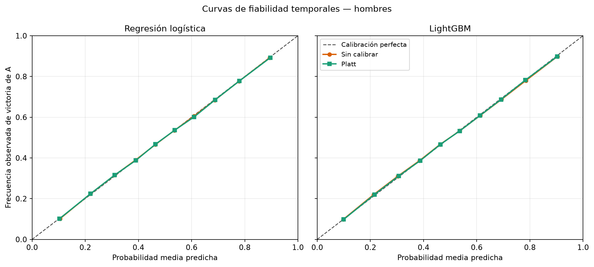
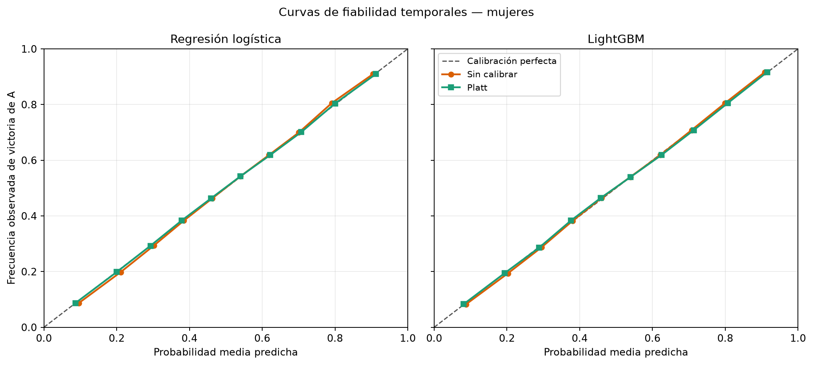

# Informe de modelos — fase 7

## Resultado reproducible

Se entrenó un LightGBM principal y una regresión logística de referencia para cada género. La evaluación es exclusivamente temporal y las probabilidades se calibran con Platt.

```text
model_fingerprint: c71a8985fdddd451282a2ea20d9589d4e522f035f6b162b54cae42c9a5421a2d
feature_fingerprint: c08239fe01d4607f734bfecf33b8e17aae1d4f8194ad5b7ccd2e35b4a2cf1e59
source_commit: 83733587353df8a41f2fd4f516147d5aa83f5a8d
feature_profile: sports_only
test_seasons: 2016-2025
fold Y: train <= Y-2; calibración = Y-1; test = Y
```

| Género | Filas entrenamiento final | Última fecha | Predicciones OOF | Folds |
| --- | --- | --- | --- | --- |
| M | 929149 | 2026-06-01 | 266980 | 10 |
| F | 751126 | 2026-06-02 | 262315 | 10 |

Los hiperparámetros fueron fijados antes de observar los bloques de test. No se hizo selección ni early stopping con calibración/test.

## Resultados globales — hombres

| Método | N | Cobertura | Accuracy | Log-loss | Brier | AUC |
| --- | --- | --- | --- | --- | --- | --- |
| Logística sin calibrar | 266.980 | 100,00 % | 0,6996 | 0,568346 | 0,193336 | 0,7740 |
| Logística + Platt | 266.980 | 100,00 % | 0,6995 | 0,568024 | 0,193268 | 0,7742 |
| LightGBM sin calibrar | 266.980 | 100,00 % | 0,7025 | 0,563125 | 0,191719 | 0,7780 |
| LightGBM + Platt | 266.980 | 100,00 % | 0,7025 | 0,563036 | 0,191690 | 0,7780 |
| Ranking probabilístico | 241.683 | 90,52 % | 0,6543 | 0,630508 | 0,219572 | 0,7048 |
| Mercado de-vigado | 0 | 0,00 % | — | — | — | — |
| Favorito por ranking | 241.590 | 90,49 % | 0,6544 | — | — | — |

### Efecto de la calibración

| Modelo | Brier antes | Brier después | Δ Brier | Log-loss antes | Log-loss después | Δ log-loss |
| --- | --- | --- | --- | --- | --- | --- |
| Regresión logística | 0.1933356586408327 | 0.1932678348220236 | -6.782381880912625e-05 | 0.568346059855672 | 0.5680235963199421 | -0.00032246353572984443 |
| LightGBM | 0.19171948115456053 | 0.1916902614766558 | -2.9219677904729346e-05 | 0.5631251216095828 | 0.5630362108749971 | -8.891073458572318e-05 |



Un delta negativo significa mejora. La curva usa diez bins por cuantiles y acumula únicamente predicciones OOF.

### Comparación justa con ranking

| Método | N común | Accuracy | Log-loss | Brier | AUC |
| --- | --- | --- | --- | --- | --- |
| Logística + Platt | 241.590 | 0,6879 | 0,581546 | 0,199270 | 0,7589 |
| LightGBM + Platt | 241.590 | 0,6904 | 0,578564 | 0,198026 | 0,7622 |
| Ranking probabilístico | 241.590 | 0,6544 | 0,630484 | 0,219560 | 0,7049 |
| Favorito por ranking | 241.590 | 0,6544 | — | — | — |

Esta tabla contiene exactamente los partidos donde el favorito por ranking es observable; no penaliza rankings ausentes.

### LightGBM calibrado por nivel × superficie

| Nivel | Superficie | N | Accuracy | Log-loss | Brier | AUC |
| --- | --- | --- | --- | --- | --- | --- |
| ATP Tour | Clay | 8.836 | 0,6514 | 0,613735 | 0,213273 | 0,7185 |
| ATP Tour | Grass | 2.375 | 0,6463 | 0,625181 | 0,217528 | 0,7074 |
| ATP Tour | Hard | 16.501 | 0,6689 | 0,600623 | 0,207801 | 0,7349 |
| Challenger | Carpet | 96 | 0,6771 | 0,615380 | 0,214323 | 0,7146 |
| Challenger | Clay | 35.787 | 0,6716 | 0,594231 | 0,205361 | 0,7411 |
| Challenger | Grass | 1.383 | 0,6529 | 0,606086 | 0,210726 | 0,7239 |
| Challenger | Hard | 39.200 | 0,6725 | 0,596262 | 0,205830 | 0,7406 |
| Grand Slam | Clay | 2.332 | 0,7071 | 0,549972 | 0,186290 | 0,7924 |
| Grand Slam | Grass | 2.101 | 0,6873 | 0,575494 | 0,196729 | 0,7656 |
| Grand Slam | Hard | 4.507 | 0,6907 | 0,573970 | 0,196253 | 0,7667 |
| ITF | Carpet | 2.708 | 0,6817 | 0,582088 | 0,199684 | 0,7578 |
| ITF | Clay | 73.194 | 0,7318 | 0,531426 | 0,178265 | 0,8093 |
| ITF | Grass | 595 | 0,7261 | 0,525508 | 0,174430 | 0,8185 |
| ITF | Hard | 75.262 | 0,7212 | 0,545036 | 0,183747 | 0,7971 |
| Other | Clay | 63 | 0,7937 | 0,471002 | 0,155316 | 0,8570 |
| Team | Carpet | 18 | 0,8333 | 0,557402 | 0,161946 | 0,8500 |
| Team | Clay | 534 | 0,7285 | 0,519072 | 0,174604 | 0,8182 |
| Team | Grass | 41 | 0,7073 | 0,569949 | 0,196073 | 0,7609 |
| Team | Hard | 1.396 | 0,7378 | 0,509442 | 0,172284 | 0,8219 |
| Team | Unknown | 51 | 0,7059 | 0,541402 | 0,181138 | 0,8302 |

## Resultados globales — mujeres

| Método | N | Cobertura | Accuracy | Log-loss | Brier | AUC |
| --- | --- | --- | --- | --- | --- | --- |
| Logística sin calibrar | 262.315 | 100,00 % | 0,7150 | 0,551915 | 0,185713 | 0,7925 |
| Logística + Platt | 262.315 | 100,00 % | 0,7151 | 0,550147 | 0,185693 | 0,7925 |
| LightGBM sin calibrar | 262.315 | 100,00 % | 0,7177 | 0,543819 | 0,183862 | 0,7966 |
| LightGBM + Platt | 262.315 | 100,00 % | 0,7176 | 0,543717 | 0,183847 | 0,7966 |
| Ranking probabilístico | 183.368 | 69,90 % | 0,6481 | 0,636521 | 0,222562 | 0,6940 |
| Mercado de-vigado | 0 | 0,00 % | — | — | — | — |
| Favorito por ranking | 183.227 | 69,85 % | 0,6484 | — | — | — |

### Efecto de la calibración

| Modelo | Brier antes | Brier después | Δ Brier | Log-loss antes | Log-loss después | Δ log-loss |
| --- | --- | --- | --- | --- | --- | --- |
| Regresión logística | 0.1857129163412951 | 0.18569282882230584 | -2.0087518989270192e-05 | 0.5519152674981218 | 0.5501472562645149 | -0.0017680112336069254 |
| LightGBM | 0.1838615876879313 | 0.1838466090814427 | -1.4978606488580404e-05 | 0.5438187490767785 | 0.5437169094047987 | -0.00010183967197985311 |



Un delta negativo significa mejora. La curva usa diez bins por cuantiles y acumula únicamente predicciones OOF.

### Comparación justa con ranking

| Método | N común | Accuracy | Log-loss | Brier | AUC |
| --- | --- | --- | --- | --- | --- |
| Logística + Platt | 183.227 | 0,6929 | 0,577313 | 0,197068 | 0,7647 |
| LightGBM + Platt | 183.227 | 0,6946 | 0,572757 | 0,195783 | 0,7678 |
| Ranking probabilístico | 183.227 | 0,6483 | 0,636478 | 0,222541 | 0,6941 |
| Favorito por ranking | 183.227 | 0,6484 | — | — | — |

Esta tabla contiene exactamente los partidos donde el favorito por ranking es observable; no penaliza rankings ausentes.

### LightGBM calibrado por nivel × superficie

| Nivel | Superficie | N | Accuracy | Log-loss | Brier | AUC |
| --- | --- | --- | --- | --- | --- | --- |
| Challenger | Clay | 3.546 | 0,6751 | 0,579573 | 0,199747 | 0,7554 |
| Challenger | Grass | 217 | 0,6636 | 0,623083 | 0,215595 | 0,7184 |
| Challenger | Hard | 3.066 | 0,6781 | 0,588486 | 0,203572 | 0,7449 |
| Grand Slam | Clay | 2.212 | 0,6967 | 0,566910 | 0,193324 | 0,7739 |
| Grand Slam | Grass | 2.039 | 0,6935 | 0,582563 | 0,199268 | 0,7596 |
| Grand Slam | Hard | 4.524 | 0,6939 | 0,578138 | 0,197863 | 0,7628 |
| ITF | Carpet | 5.229 | 0,7248 | 0,540513 | 0,181711 | 0,8023 |
| ITF | Clay | 102.126 | 0,7270 | 0,531720 | 0,178899 | 0,8077 |
| ITF | Grass | 1.576 | 0,6999 | 0,570549 | 0,195509 | 0,7679 |
| ITF | Hard | 108.090 | 0,7240 | 0,537036 | 0,180945 | 0,8033 |
| Other | Clay | 62 | 0,6452 | 0,623672 | 0,219656 | 0,6693 |
| Other | Hard | 122 | 0,6475 | 0,623332 | 0,215553 | 0,7192 |
| Team | Clay | 633 | 0,7567 | 0,482660 | 0,159366 | 0,8478 |
| Team | Grass | 4 | 0,5000 | 0,998649 | 0,321482 | 0,7500 |
| Team | Hard | 1.252 | 0,7372 | 0,501093 | 0,168409 | 0,8307 |
| Team | Unknown | 93 | 0,7527 | 0,460961 | 0,154309 | 0,8548 |
| WTA Tour | Clay | 7.051 | 0,6720 | 0,596117 | 0,205437 | 0,7420 |
| WTA Tour | Grass | 2.356 | 0,6694 | 0,606903 | 0,210430 | 0,7280 |
| WTA Tour | Hard | 18.117 | 0,6751 | 0,594430 | 0,205274 | 0,7419 |

## Comparación con el mercado

| Género | Filas OOF | Con mercado | Cobertura | Estado |
| --- | --- | --- | --- | --- |
| M | 266980 | 0 | 0,00 % | NO EVALUABLE — cobertura histórica 0 % |
| F | 262315 | 0 | 0,00 % | NO EVALUABLE — cobertura histórica 0 % |

Sackmann no contiene cuotas históricas y la fase 6 declara `historical_odds_available=false`. Por ello, el favorito por cuota y el valor añadido frente al mercado son **NO EVALUABLES** en este run. No se imputó ninguna cuota. El evaluador ya genera la comparación sobre soporte común cuando existan observaciones de-vigadas capturadas antes del partido.

## Auditoría de accuracy superior al 85 %

No apareció ningún segmento con accuracy estrictamente superior al 85 %.

## Limitaciones

- No existen cuotas históricas causales: todavía no puede demostrarse ventaja sobre el mercado ni entrenarse el perfil `market_enhanced`.
- `tourney_date` suele ser el inicio del torneo. Congelar el bloque completo evita fugas entre rondas, pero pierde señal.
- El fold de test 2021 se calibra con la temporada atípica 2020. Se conserva porque mantiene el protocolo y tiene miles de casos.
- La cobertura de rankings, especialmente femenina, varía con el tiempo. Las comparaciones usan soporte común.
- Hay colisiones históricas de IDs/fechas de nacimiento, valores extremos de descanso y rankings antiguos. Los nulos se señalan; no se corrigen biografías ni resultados de forma especulativa.
- 2026 es parcial y no forma parte del backtest principal. Sí entra al estimador final, porque ya es pasado para futuras predicciones.
- Los hiperparámetros son conservadores y fijos. La fase no presenta un barrido de hiperparámetros como si fuera evidencia independiente.

## Artefactos detallados

Las métricas completas, predicciones OOF, folds, calibradores y modelos están en `../models/phase7/runs/c71a8985fdddd451282a2ea20d9589d4e522f035f6b162b54cae42c9a5421a2d`. `metrics.csv` incluye todos los modelos y segmentos, además de las poblaciones de soporte común.
